# 监控部署与爬坑

## prometheus部署与记录


### Server端

#### 1.进程部署

```shell
#下载地址：
https://prometheus.io/download/
#解压：
tar -xvf prometheus-2.47.2.linux-amd64.tar.gz
#修改配置文件
cd prometheus-2.47.2.linux-amd64
vim prometheus.yml

##简易配置文件示例
global:
  scrape_interval:     15s # 默认情况下，每 15s 采集一次目标数据
  # 与外部系统(如 federation, remote storage, Alertmanager)通信时，可以将这些标签应用到到和时间序列或告警上
  external_labels:
    monitor: 'codelab-monitor'
# 仅包含一个采集端点的采集配置：这里是 Prometheus 本身
scrape_configs:
  # 作业名称作为标签 `job=<job_name>` 添加到从此配置中采集的时间序列上
  - job_name: 'prometheus'

    # 覆盖全局默认的参数，并将采样时间间隔设置为 5s
    scrape_interval: 5s
    static_configs:
      - targets: ['localhost:9090']
      
#启动服务(前台启动)
./prometheus
#添加服务到systemctl
vim prometheus.service

[Unit]
Description=Prometheus Monitoring System
Wants=network-online.target
After=network-online.target

[Service]
User=root
Group=root
Type=simple
ExecStart=/data/prometheus-2.47.2.linux-amd64/prometheus --web.enable-remote-write-receiver --config.file=/data/prometheus-2.47.2.linux-amd64/prometheus.yml

[Install]
WantedBy=multi-user.target

#复制到/etc/systemd/system
cp prometheus.service /etc/systemd/system/
#加载到service
systemctl daemon-reload
systemctl start prometheus.service
systemctl enable prometheus.service
systemctl status prometheus.service
```

#### 2.docker部署

未完成

### Exporter

Exporter的一个实例称为target


常见Exporter

| 范围     | 常用Exporter                                                 |
| :------- | :----------------------------------------------------------- |
| 数据库   | MySQL Exporter, Redis Exporter, MongoDB Exporter, MSSQL Exporter等 |
| 硬件     | Apcupsd Exporter，IoT Edison Exporter， IPMI Exporter, Node Exporter等 |
| 消息队列 | Beanstalkd Exporter, Kafka Exporter, NSQ Exporter, RabbitMQ Exporter等 |
| 存储     | Ceph Exporter, Gluster Exporter, HDFS Exporter, ScaleIO Exporter等 |
| HTTP服务 | Apache Exporter, HAProxy Exporter, Nginx Exporter等          |
| API服务  | AWS ECS Exporter， Docker Cloud Exporter, Docker Hub Exporter, GitHub Exporter等 |
| 日志     | Fluentd Exporter, Grok Exporter等                            |
| 监控系统 | Collectd Exporter, Graphite Exporter, InfluxDB Exporter, Nagios Exporter, SNMP Exporter等 |
| 其它     | Blockbox Exporter, JIRA Exporter, Jenkins Exporter， Confluence Exporter等 |

所有的Exporter程序都需要按照Prometheus的规范，返回监控的样本数据。以Node Exporter为例，当访问/metrics地址时会返回以下内容：

```shell
# HELP node_cpu Seconds the cpus spent in each mode.
# TYPE node_cpu counter
node_cpu{cpu="cpu0",mode="idle"} 362812.7890625
# HELP node_load1 1m load average.
# TYPE node_load1 gauge
node_load1 3.0703125
```

Exporter返回的样本数据，主要由三个部分组成：样本的一般注释信息（HELP），样本的类型注释信息（TYPE）和样本。

在Exporter响应的HTTP头信息中，可以通过Content-Type指定特定的规范版本，例如：

```shell
HTTP/1.1 200 OK
Content-Encoding: gzip
Content-Length: 2906
Content-Type: text/plain; version=0.0.4
Date: Sat, 17 Mar 2018 08:47:06 GMT
```

其中version用于指定Text-based的格式版本，当没有指定版本的时候，默认使用最新格式规范的版本。同时HTTP响应头还需要指定压缩格式为gzip。

#### Node Exporter

为了能够采集到主机的运行指标如CPU, 内存，磁盘等信息。我们可以使用[Node Exporter](https://github.com/prometheus/node_exporter)

***注意：放通对应端口，server端放通出站9090，node端放通入站9100等***

```shell
#下载与解压
https://github.com/prometheus/node_exporter/releases/download
tar -xzf node_exporter-1.6.1.linux-amd64.tar.gz
cd node_exporter-1.6.1.linux-amd64
#运行node_exporter
nohup ./node_exporter &
```

为了能够让Prometheus Server能够从当前node exporter获取到监控数据，这里需要修改Prometheus配置文件。编辑prometheus.yml并在scrape_configs节点下添加以下内容:

```shell
vim /data/prometheus-2.47.2.linux-amd64/prometheus.yml

#找到scrape_configs节点下添加以下内容
scrape_configs:
  - job_name: 'prometheus'
    static_configs:
      - targets: ['localhost:9090']
  # 采集node exporter监控数据
  - job_name: 'node'
    static_configs:
      - targets: ['localhost:9100']
#重启prometheus
systemctl restart prometheus
```

访问[http://youserverip:9090](http://youserveip:9090/)，进入到Prometheus Server。如果输入“up”并且点击执行按钮以后，可以看到如下结果：

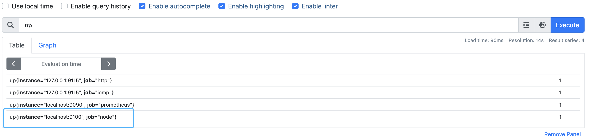

Value = 1则为正常

##### Grafana模版

```shell
#模版id
16098
```

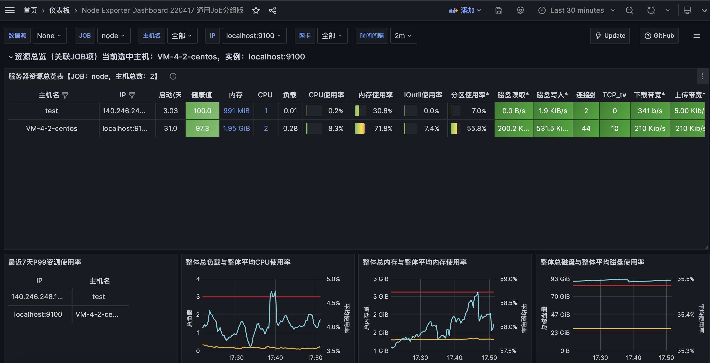

#### 容器监控：cAdvisor

CAdvisor是Google开源的一款用于展示和分析容器运行状态的可视化工具。通过在主机上运行CAdvisor用户可以轻松的获取到当前主机上容器的运行统计信息，并以图表的形式向用户展示。

##### 启动方式

```dockerfile
docker run \
  --volume=/:/rootfs:ro \
  --volume=/var/run:/var/run:rw \
  --volume=/sys:/sys:ro \
  --volume=/var/lib/docker/:/var/lib/docker:ro \
  --publish=8081:8080 \
  --detach=true \
  --name=cadvisor \
  google/cadvisor:latest
```

##### 监控信息查看

```shell
#监控UI界面
http://124.220.15.126:8081
#监控信息（prometheus标准输出）
http://124.220.15.126:8081/metrics
```

| 指标名称                               | 类型    | 含义                                         |
| :------------------------------------- | :------ | :------------------------------------------- |
| container_cpu_load_average_10s         | gauge   | 过去10秒容器CPU的平均负载                    |
| container_cpu_usage_seconds_total      | counter | 容器在每个CPU内核上的累积占用时间 (单位：秒) |
| container_cpu_system_seconds_total     | counter | System CPU累积占用时间（单位：秒）           |
| container_cpu_user_seconds_total       | counter | User CPU累积占用时间（单位：秒）             |
| container_fs_usage_bytes               | gauge   | 容器中文件系统的使用量(单位：字节)           |
| container_fs_limit_bytes               | gauge   | 容器可以使用的文件系统总量(单位：字节)       |
| container_fs_reads_bytes_total         | counter | 容器累积读取数据的总量(单位：字节)           |
| container_fs_writes_bytes_total        | counter | 容器累积写入数据的总量(单位：字节)           |
| container_memory_max_usage_bytes       | gauge   | 容器的最大内存使用量（单位：字节）           |
| container_memory_usage_bytes           | gauge   | 容器当前的内存使用量（单位：字节             |
| container_spec_memory_limit_bytes      | gauge   | 容器的内存使用量限制                         |
| machine_memory_bytes                   | gauge   | 当前主机的内存总量                           |
| container_network_receive_bytes_total  | counter | 容器网络累积接收数据总量（单位：字节）       |
| container_network_transmit_bytes_total | counter | 容器网络累积传输数据总量（单位：字节）       |

##### 集成至prometheus

添加配置文件至prometheus.yml

```yaml
- job_name: cadvisor
  static_configs:
  - targets:
    - localhost:8081
```

重启prometheus服务

启动后登陆UI界面查看状态

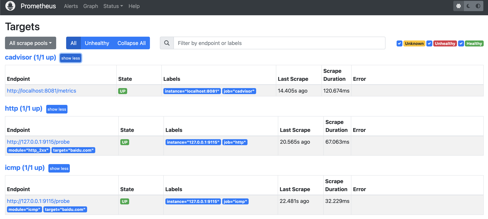

当能够正常采集到cAdvisor的样本数据后，可以通过以下表达式计算容器的CPU使用率：

```shell
sum(irate(container_cpu_usage_seconds_total{image!=""}[1m])) without (cpu)
```

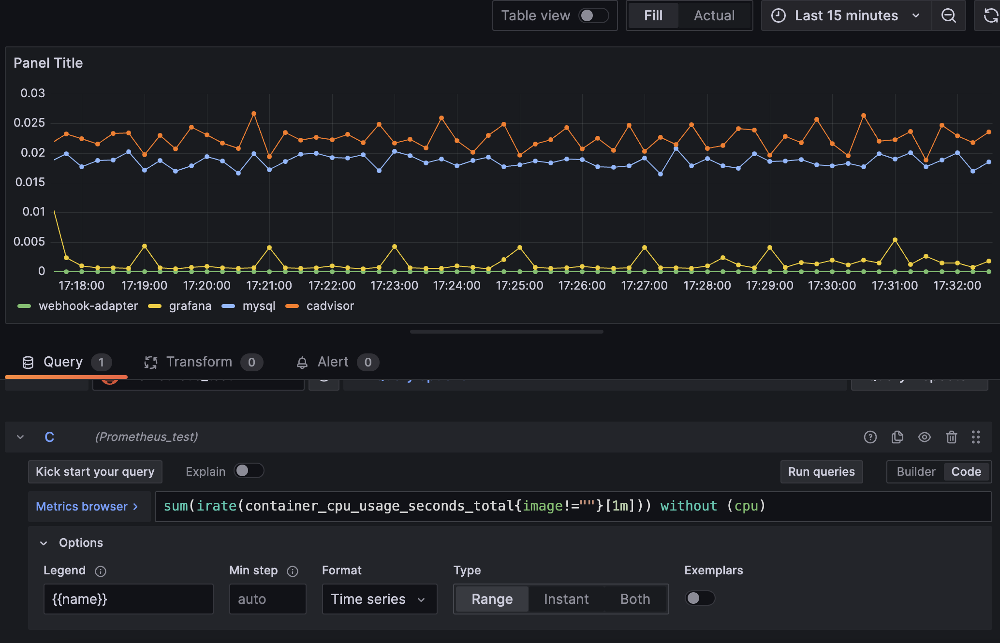

查询容器内存使用量（单位：字节）:

```text
container_memory_usage_bytes{image!=""}
```

查询容器网络接收量速率（单位：字节/秒）：

```text
sum(rate(container_network_receive_bytes_total{image!=""}[1m])) without (interface)
```

查询容器网络传输量速率（单位：字节/秒）：

```text
sum(rate(container_network_transmit_bytes_total{image!=""}[1m])) without (interface)
```

查询容器文件系统读取速率（单位：字节/秒）：

```text
sum(rate(container_fs_reads_bytes_total{image!=""}[1m])) without (device)
```

查询容器文件系统写入速率（单位：字节/秒）：

```text
sum(rate(container_fs_writes_bytes_total{image!=""}[1m])) without (device)
```

##### Grafana模版

```shell
#测试地址
http://124.220.15.126:3000/d/htoVWdxGk/dockere4b8ad-e88bb1-e78988?orgId=1&refresh=30s&from=1700470066071&to=1700473666071
#模版id
10619
```

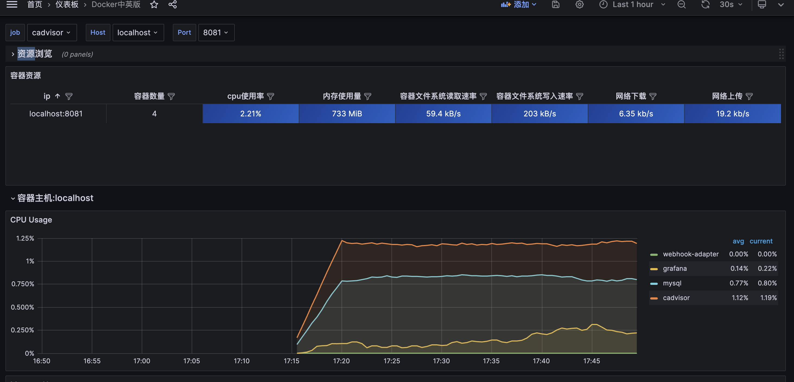

#### Mysqld Exporter

##### 部署方式

安装包部署

下载地址

```
https://github.com/prometheus/mysqld_exporter/releases
```

解压编辑配置文件

```shell
tar -xvf mysqld_exporter_xxxx.tar
vim .my.cnf
[client]
host=127.0.0.1
port=3306
user=root
password=root
```

启动服务

```shell
nohup ./mysqld_exporter --config.my-cnf=.my.cnf &
```

编辑prometheus配置文件，添加mysql_job

```yaml
- job_name: mysqld
  static_configs:
  - targets:
    - localhost:9104
```

重启prometheus服务

```shell
systemctl restart prometheus
```

查看Target状态

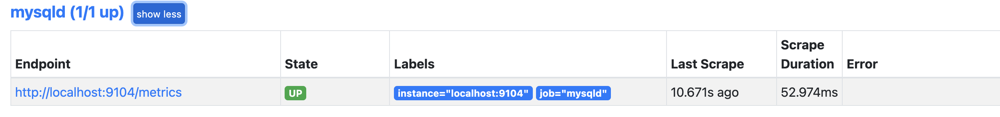

##### 常见监控指标

下面列举了与MySQL连接相关的监控指标：

- mysql_global_variables_max_connections： 允许的最大连接数；
- mysql_global_status_threads_connected： 当前开放的连接；
- mysql_global_status_threads_running：当前开放的连接；
- mysql_global_status_aborted_connects：当前开放的连接；
- mysql_global_status_connection_errors_total{error=“max_connections”}：由于超出最大连接数导致的错误；
- mysql_global_status_connection_errors_total{error=“internal”}：由于系统内部导致的错误；
- mysql_global_status_slow_queries 慢查询

##### Grafana模版

```shell
#模版ID
17320
```


#### Blackbox Exporter网络探测

##### 部署方式

安装包部署

```
https://github.com/prometheus/blackbox_exporter/releases
```

解压编辑配置文件

```shell
tar -xvf blackbox_exporter-0.24.0.linux-amd64.tar.gz
vim blackbox.yml
modules:
  http_2xx:
    prober: http
  icmp:
    prober: icmp
```

##### 配置文件详解

在Blackbox Exporter每一个探针配置称为一个module，并且以YAML配置文件的形式提供给Blackbox Exporter。 每一个module主要包含以下配置内容，包括探针类型（prober）、验证访问超时时间（timeout）、以及当前探针的具体配置项：

```yaml
  # 探针类型：http、 tcp、 dns、 icmp.
  prober: <prober_string>

  # 超时时间
  [ timeout: <duration> ]

  # 探针的详细配置，最多只能配置其中的一个
  [ http: <http_probe> ]
  [ tcp: <tcp_probe> ]
  [ dns: <dns_probe> ]
  [ icmp: <icmp_probe> ]
```

下面是一个简化的探针配置文件blockbox.yml，包含两个HTTP探针配置项：

```yaml
modules:
  http_2xx:
    prober: http
    http:
      method: GET
  http_post_2xx:
    prober: http
    http:
      method: POST
```

##### 启动服务

```shell
nohup ./blackbox_exporter --config.file=/data/balckbox_xxx_xxx/blackbox.yml &
```

GET测试

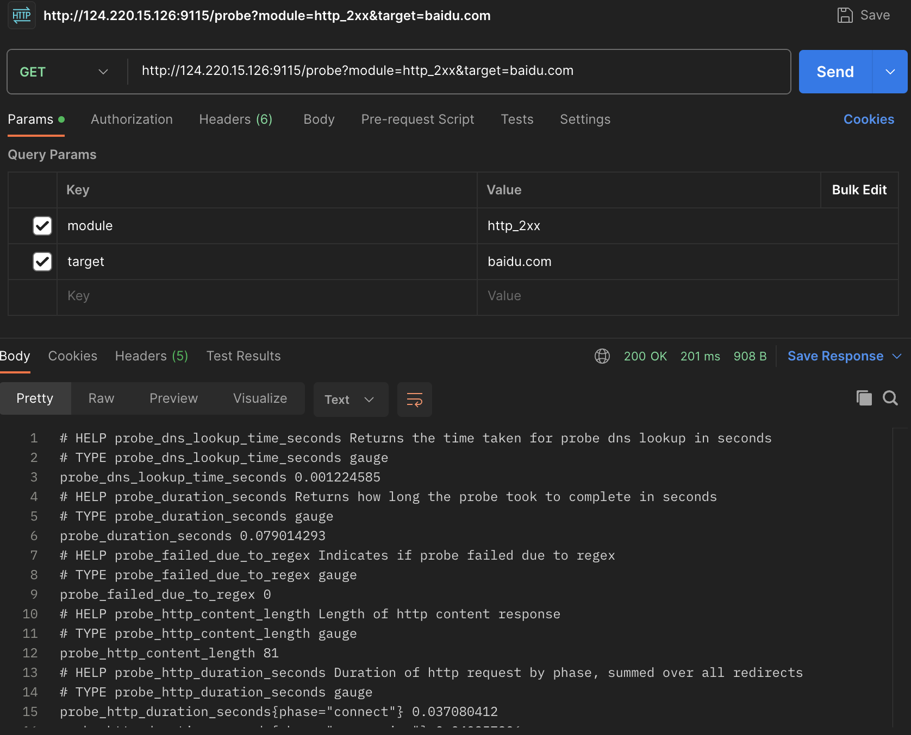

##### 集成至prometheus

```yaml
- job_name: icmp
    params:
    	#探针
      module:
      - icmp
      #探测目标
      target:
      - baidu.com
    metrics_path: /probe
    static_configs:
    - targets:
      - 127.0.0.1:9115
 - job_name: http
    params:
      module:
      - http_2xx
      target:
      - baidu.com
    metrics_path: /probe
    static_configs:
    - targets:
      - 127.0.0.1:9115
```

##### 重启prometheus服务

查看状态

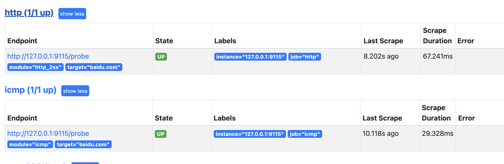

##### HTTP探针

配置项http用于自定义探针的探测方式，这里有没对http配置项添加任何配置，表示完全使用HTTP探针的默认配置，该探针将使用HTTP GET的方式对目标服务进行探测，并且验证返回状态码是否为2XX，是则表示验证成功，否则失败。

如下所示，这里通过method定义了探测时使用的请求方法，对于一些需要请求参数的服务，还可以通过headers定义相关的请求头信息，使用body定义请求内容：

```yaml
http_post_2xx:
    prober: http
    timeout: 5s
    http:
      method: POST
      headers:
        Content-Type: application/json
      body: '{}'
```

如果HTTP服务启用了安全认证，Blockbox Exporter内置了对basic_auth的支持，可以直接设置相关的认证信息即可：

```yaml
http_basic_auth_example:
    prober: http
    timeout: 5s
    http:
      method: POST
      headers:
        Host: "login.example.com"
      basic_auth:
        username: "username"
        password: "mysecret"
```

##### HTTP探针示例

###### POST探测网站

```yaml
#探针配置
http_post_2xx:
    prober: http
    timeout: 5s
    http:
      method: POST
      headers:
        Content-Type: application/json
      body: '{"msgtype": "text",
              "text": {
                "content": "正在测试"
        }}'
        
#prometheus配置
- job_name: 'blackbox_post'
    metrics_path: /probe
    params:
      module: [http_post_2xx]  # Blackbox Exporter 模块配置，可以添加更多的模块
    static_configs:
      - targets:
        - https://qyapi.weixin.qq.com/cgi-bin/webhook/send?key=c7305ec5-ad97-4da2-82e7-edaf546238ab
    relabel_configs:
      - source_labels: [__address__]
        target_label: __param_target
      - source_labels: [__param_target]
        target_label: instance
      - target_label: __address__
        replacement: 127.0.0.1:9115 # Blackbox Exporter 的地址
```

###### GET探测多个网站

```yaml
- job_name: 'blackbox'
    metrics_path: /probe
    params:
      module: [http_2xx]  # Blackbox Exporter 模块配置，可以添加更多的模块
    static_configs:
      - targets:
        - https://www.baidu.com
        - http://124.220.15.126:3000
    relabel_configs:
      - source_labels: [__address__]
        target_label: __param_target
      - source_labels: [__param_target]
        target_label: instance
      - target_label: __address__
        replacement: 127.0.0.1:9115 # Blackbox Exporter 的地址
```

#### Grafana模版

```shell
##模版ID
9965
```

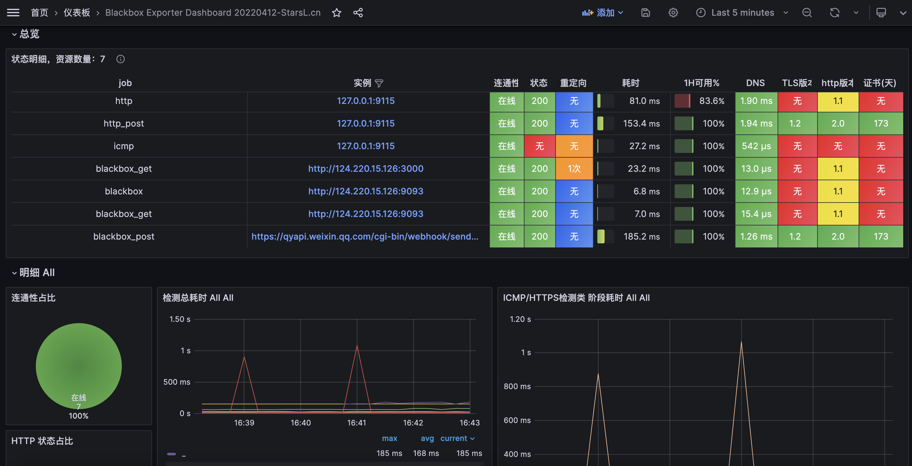

### METRIC(指标)

Prometheus定义了4种不同的指标类型(metric type)：Counter（计数器）、Gauge（仪表盘）、Histogram（直方图）、Summary（摘要）

#### Counter：只增不减的计数器

Counter类型的指标其工作方式和计数器一样，只增不减（除非系统发生重置）。常见的监控指标，如http_requests_total，node_cpu都是Counter类型的监控指标。 一般在定义Counter类型指标的名称时推荐使用_total作为后缀。

Counter是一个简单但有强大的工具，例如我们可以在应用程序中记录某些事件发生的次数，通过以时序的形式存储这些数据，我们可以轻松的了解该事件产生速率的变化。 PromQL内置的聚合操作和函数可以让用户对这些数据进行进一步的分析：

例如，通过rate()函数获取HTTP请求量的增长率：

```shell
rate(http_requests_total[5m])
```

查询当前系统中，访问量前10的HTTP地址：

```shell
topk(10, http_requests_total)
```

#### Gauge：可增可减的仪表盘

与Counter不同，Gauge类型的指标侧重于反应系统的当前状态。因此这类指标的样本数据可增可减。常见指标如：node_memory_MemFree（主机当前空闲的内存大小）、node_memory_MemAvailable（可用内存大小）都是Gauge类型的监控指标。

通过Gauge指标，用户可以直接查看系统的当前状态：

```
node_memory_MemFree
```

对于Gauge类型的监控指标，通过PromQL内置函数delta()可以获取样本在一段时间返回内的变化情况。例如，计算CPU温度在两个小时内的差异：

```
delta(cpu_temp_celsius{host="zeus"}[2h])
```

还可以使用deriv()计算样本的线性回归模型，甚至是直接使用predict_linear()对数据的变化趋势进行预测。例如，预测系统磁盘空间在4个小时之后的剩余情况：

```
predict_linear(node_filesystem_free{job="node"}[1h], 4 * 3600)
```

#### 使用Histogram和Summary分析数据分布情况

除了Counter和Gauge类型的监控指标以外，Prometheus还定义了Histogram和Summary的指标类型。Histogram和Summary主要用于统计和分析样本的分布情况。

在大多数情况下人们都倾向于使用某些量化指标的平均值，例如CPU的平均使用率、页面的平均响应时间。这种方式的问题很明显，以系统API调用的平均响应时间为例：如果大多数API请求都维持在100ms的响应时间范围内，而个别请求的响应时间需要5s，那么就会导致某些WEB页面的响应时间落到中位数的情况，而这种现象被称为长尾问题。

例如，指标prometheus_tsdb_wal_fsync_duration_seconds的指标类型为Summary。 它记录了Prometheus Server中wal_fsync处理的处理时间，通过访问Prometheus Server的/metrics地址，可以获取到以下监控样本数据：

```shell
# HELP prometheus_tsdb_wal_fsync_duration_seconds Duration of WAL fsync.
# TYPE prometheus_tsdb_wal_fsync_duration_seconds summary
prometheus_tsdb_wal_fsync_duration_seconds{quantile="0.5"} 0.012352463
prometheus_tsdb_wal_fsync_duration_seconds{quantile="0.9"} 0.014458005
prometheus_tsdb_wal_fsync_duration_seconds{quantile="0.99"} 0.017316173
prometheus_tsdb_wal_fsync_duration_seconds_sum 2.888716127000002
prometheus_tsdb_wal_fsync_duration_seconds_count 216
```

从上面的样本中可以得知当前Prometheus Server进行wal_fsync操作的总次数为216次，耗时2.888716127000002s。其中中位数（quantile=0.5）的耗时为0.012352463，9分位数（quantile=0.9）的耗时为0.014458005s。

在Prometheus Server自身返回的样本数据中，我们还能找到类型为Histogram的监控指标prometheus_tsdb_compaction_chunk_range_bucket。

```shell
# HELP prometheus_tsdb_compaction_chunk_range Final time range of chunks on their first compaction
# TYPE prometheus_tsdb_compaction_chunk_range histogram
prometheus_tsdb_compaction_chunk_range_bucket{le="100"} 0
prometheus_tsdb_compaction_chunk_range_bucket{le="400"} 0
prometheus_tsdb_compaction_chunk_range_bucket{le="1600"} 0
prometheus_tsdb_compaction_chunk_range_bucket{le="6400"} 0
prometheus_tsdb_compaction_chunk_range_bucket{le="25600"} 0
prometheus_tsdb_compaction_chunk_range_bucket{le="102400"} 0
prometheus_tsdb_compaction_chunk_range_bucket{le="409600"} 0
prometheus_tsdb_compaction_chunk_range_bucket{le="1.6384e+06"} 260
prometheus_tsdb_compaction_chunk_range_bucket{le="6.5536e+06"} 780
prometheus_tsdb_compaction_chunk_range_bucket{le="2.62144e+07"} 780
prometheus_tsdb_compaction_chunk_range_bucket{le="+Inf"} 780
prometheus_tsdb_compaction_chunk_range_sum 1.1540798e+09
prometheus_tsdb_compaction_chunk_range_count 780
```

与Summary类型的指标相似之处在于Histogram类型的样本同样会反应当前指标的记录的总数(以_count作为后缀)以及其值的总量（以_sum作为后缀）。不同在于Histogram指标直接反应了在不同区间内样本的个数，区间通过标签len进行定义。

同时对于Histogram的指标，我们还可以通过histogram_quantile()函数计算出其值的分位数。不同在于Histogram通过histogram_quantile函数是在服务器端计算的分位数。 而Sumamry的分位数则是直接在客户端计算完成。因此对于分位数的计算而言，Summary在通过PromQL进行查询时有更好的性能表现，而Histogram则会消耗更多的资源。反之对于客户端而言Histogram消耗的资源更少。在选择这两种方式时用户应该按照自己的实际场景进行选择。

### PromQL

#### 查询时间序列

##### =,!=,=~,!~

直接使用监控名称，如

```shell
prometheus_http_requests_total
```

等同于

```shell
prometheus_http_requests_total{}
```

结果返回所有标签

```shell
prometheus_http_requests_total{code="200", handler="/", instance="localhost:9090", job="prometheus"}
```

PromQL支持使用`=`和`!=`两种完全匹配模式：

- 通过使用`label=value`可以选择那些标签满足表达式定义的时间序列；
- 反之使用`label!=value`则可以根据标签匹配排除时间序列；

如，查询满足 **instance**="localhost:9090"

```shell
prometheus_http_requests_total{instance="localhost:9090"}
```

或，查询不满足 **instance**="localhost:9090"

```shell
prometheus_http_requests_total{instance!="localhost:9090"}
```

支持正则表达式

```shell
prometheus_http_requests_total{instance=~"localhost:9090"}

prometheus_http_requests_total{instance!~"localhost:9090"}
```

#### 范围查询

##### 时间范围选择器[]

一般查询为当前值称为__瞬时向量__，表达式称为__瞬时向量表达式__

```shell
prometheus_http_requests_total{}
```

当我们需要采集过去一段时间范围内的样本数据时，需要使用__区间向量表达式__，时间范围通过__时间范围选择器[]__进行定义。

如，上述样本5分钟内的数据

```shell
prometheus_http_requests_total{}[5m]
```

通过区间向量表达式查询到的结果我们称为__区间向量__。

除了使用m表示分钟以外，PromQL的时间范围选择器支持其它时间单位：

- s - 秒
- m - 分钟
- h - 小时
- d - 天
- w - 周
- y - 年

#### 时间位移操作

##### offset

在上述瞬时向量表达式或者区间向量表达式中，都是以当前时间为基准

如果需要查询历史数据可以使用__offset__进行时间位移查询

如，5分钟前的瞬时向量

```shell
prometheus_http_requests_total{} offset 5m
```

如，1天前的历史数据

```shell
http_request_total{}[1d] offset 1d
```

#### 聚合操作

##### SUM,AVG....

Prometheus还提供了下列内置的聚合操作符，这些操作符作用域瞬时向量。可以将瞬时表达式返回的样本数据进行聚合，形成一个新的时间序列。

- `sum` (求和)
- `min` (最小值)
- `max` (最大值)
- `avg` (平均值)
- `stddev` (标准差)
- `stdvar` (标准方差)
- `count` (计数)
- `count_values` (对value进行计数)
- `bottomk` (后n条时序)
- `topk` (前n条时序)
- `quantile` (分位数)


使用聚合操作的语法如下：

```shell
<aggr-op>([parameter,] <vector expression>) [without|by (<label list>)]
```

其中只有`count_values`, `quantile`, `topk`, `bottomk`支持参数(parameter)。

without用于从计算结果中移除列举的标签，而保留其它标签。by则正好相反，结果向量中只保留列出的标签，其余标签则移除。通过without和by可以按照样本的问题对数据进行聚合。

如:

```
sum(prometheus_http_requests_total) without (instance)
```

等价于:

```shell
sum(prometheus_http_requests_total) by (code,handler,job,method)
```

查询所有http请求数量

```
sum(prometheus_http_requests_total{})
```

count_values用于时间序列中每一个样本值出现的次数。count_values会为每一个唯一的样本值输出一个时间序列，并且每一个时间序列包含一个额外的标签。

```shell
count_values("count",prometheus_http_requests_total)
```

topk和bottomk则用于对样本值进行排序，返回当前样本值前n位，或者后n位的时间序列。

```shell
topk(5,prometheus_http_requests_total)#前五

bottomk(5,prometheus_http_requests_total > 0)#后五 & >0
```

quantile用于计算当前样本数据值的分布情况quantile(φ, express)其中0 ≤ φ ≤ 1。

```sh
quantile(0.9,prometheus_http_requests_total)
```

按照mode计算主机CPU的平均使用时间

```
avg(node_cpu_seconds_total) by (mode)
```

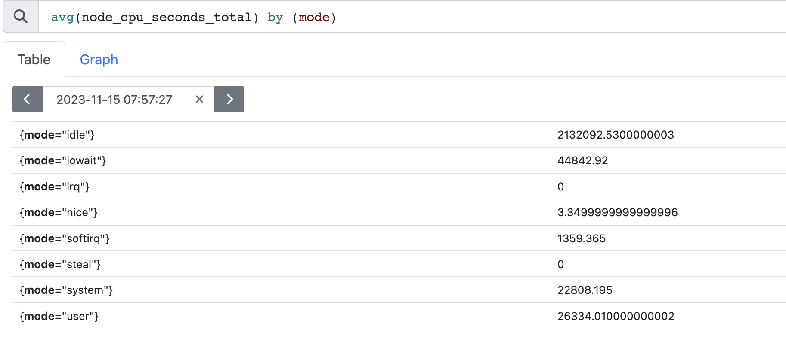

按照主机查询各个主机的CPU使用率

```shell
sum(sum(irate(node_cpu_seconds_total{mode!='idle'}[5m]))  / sum(irate(node_cpu_seconds_total[5m]))) by (instance)
```

#### 标量和字符串

支持直接输入标量和字符串

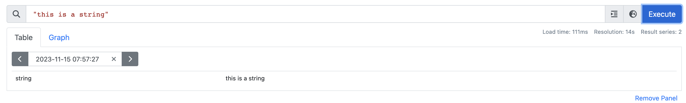

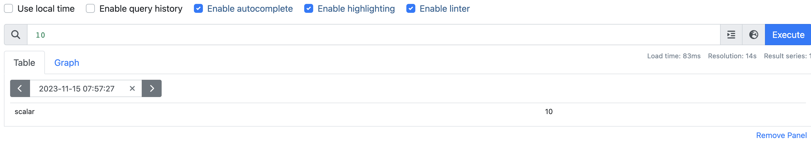

#### 合法的PromQL表达式

所有的PromQL表达式都必须至少包含一个指标名称(例如http_request_total)，或者一个不会匹配到空字符串的标签过滤器(例如{code=“200”})。

因此以下两种方式，均为合法的表达式：

```
http_request_total # 合法
http_request_total{} # 合法
{method="get"} # 合法
```

同时，除了使用`<metric name>{label=value}`的形式以外，我们还可以使用内置的`__name__`标签来指定监控指标名称：	

```
{__name__=~"node_cpu_guest_seconds_total|node_cpu_seconds_total"}
{__name__="node_cpu_guest_seconds_total"}
```

#### 操作符

##### 数学运算

```shell
node_memory_Active_bytes/(1024*1024)

node_disk_written_bytes_total + node_disk_read_bytes_total
```

PromQL支持的所有数学运算符如下所示：

- `+` (加法)
- `-` (减法)
- `*` (乘法)
- `/` (除法)
- `%` (求余)
- `^` (幂运算)

##### 布尔运算

内存使用率超过95%的主机

```
(node_memory_bytes_total - node_memory_free_bytes_total) / node_memory_bytes_total > 0.95
```

瞬时向量与标量进行布尔运算时，PromQL依次比较向量中的所有时间序列样本的值，如果比较结果为true则保留，反之丢弃。

瞬时向量与瞬时向量直接进行布尔运算时，同样遵循默认的匹配模式：依次找到与左边向量元素匹配（标签完全一致）的右边向量元素进行相应的操作，如果没找到匹配元素，则直接丢弃。

目前，Prometheus支持以下布尔运算符如下：

- `==` (相等)
- `!=` (不相等)
- `>` (大于)
- `<` (小于)
- `>=` (大于等于)
- `<=` (小于等于)

使用bool修饰符改变布尔运算符的行为

正常，仅输出>100的结果

```
prometheus_http_requests_total > 100
```

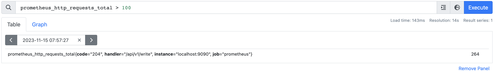

使用bool修饰符

```
prometheus_http_requests_total > bool 100，符合条件输出为1，否则为0
```

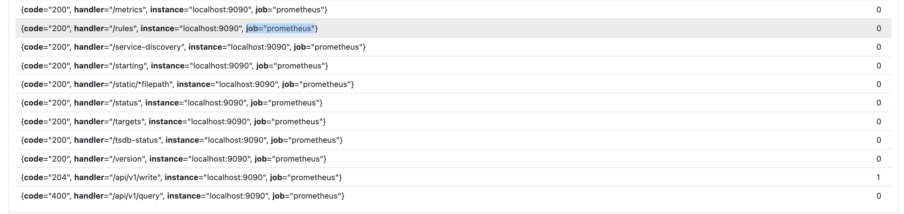

#### 使用集合运算符

使用瞬时向量表达式能够获取到一个包含多个时间序列的集合，我们称为瞬时向量。 通过集合运算，可以在两个瞬时向量与瞬时向量之间进行相应的集合操作。目前，Prometheus支持以下集合运算符：

- `and` (并且)
- `or` (或者)
- unless` (排除)

***vector1 and vector2*** 会产生一个由vector1的元素组成的新的向量。该向量包含vector1中完全匹配vector2中的元素组成。

***vector1 or vector2*** 会产生一个新的向量，该向量包含vector1中所有的样本数据，以及vector2中没有与vector1匹配到的样本数据。

***vector1 unless vector2*** 会产生一个新的向量，新向量中的元素由vector1中没有与vector2匹配的元素组成。

#### 操作符优先级

在PromQL操作符中优先级由高到低依次为：

1. `^`
2. `*, /, %`
3. `+, -`
4. `==, !=, <=, <, >=, >`
5. `and, unless`
6. `or`

#### 内置函数

##### Counter指标增长率

###### increase和rate

Counter类型的监控指标其特点是只增不减，在没有发生重置（如服务器重启，应用重启）的情况下其样本值应该是不断增大的。为了能够更直观的表示样本数据的变化剧烈情况，需要计算样本的增长速率。

increase(v range-vector)函数是PromQL中提供的众多内置函数之一。其中参数v是一个区间向量，increase函数获取区间向量中的第一个后最后一个样本并返回其增长量。因此，可以通过以下表达式Counter类型指标的增长率：

```shell
increase(node_cpu_seconds_total{cpu="0",mode="idle"}[2m]) / 120
```

除了使用increase函数以外，PromQL中还直接内置了rate(v range-vector)函数，rate函数可以直接计算区间向量v在时间窗口内平均增长速率。因此，通过以下表达式可以得到与increase函数相同的结果

```shell
rate(node_cpu_seconds_total{cpu="0",mode="idle"}[2m])
```

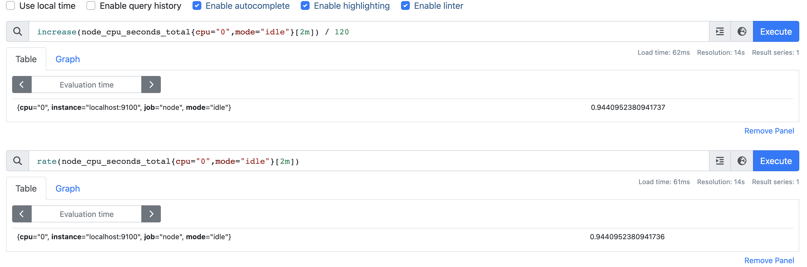

###### 瞬时增长irate

**需要注意的是使用rate或者increase函数去计算样本的平均增长速率，容易陷入“长尾问题”当中，其无法反应在时间窗口内样本数据的突发变化。**

为了解决该问题，PromQL提供了另外一个灵敏度更高的函数irate(v range-vector)。irate同样用于计算区间向量的计算率，但是其反应出的是瞬时增长率。

```shell
irate(node_cpu_seconds_total{cpu="0",mode="idle"}[2m])
```

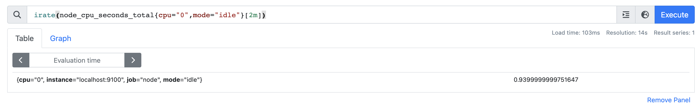

##### 预测Gauge变化趋势

应对突增的变化趋势，进行变化趋势预测。如，磁盘，内存等。

PromQL中内置的predict_linear(v range-vector, t scalar) 函数可以帮助系统管理员更好的处理此类情况，predict_linear函数可以预测时间序列v在t秒后的值。它基于简单线性回归的方式，对时间窗口内的样本数据进行统计，从而可以对时间序列的变化趋势做出预测。

如，下面整个查询的目的是预测未来4小时内节点文件系统中可用文件的数量是否会低于100,000,000。如果预测的可用文件数量低于这个阈值，可能触发某种告警或警报机制。

```shell
predict_linear(node_filesystem_files_free{job="node"}[2h], 4 * 3600) < 100000000
```

##### 统计Histogram指标的分位数

Histogram和Summary都可以用于统计和分析数据的分布情况。区别在于Summary是直接在客户端计算了数据分布的分位数情况。而Histogram的分位数计算需要通过histogram_quantile(φ float, b instant-vector)函数进行计算。其中φ（0<φ<1）表示需要计算的分位数，如果需要计算中位数φ取值为0.5，以此类推即可。

```shell
histogram_quantile(0.5,prometheus_http_request_duration_seconds_bucket)
```

#### HTTP API中使用PromQL

##### 响应格式

json格式

当API调用成功后将会返回2xx的HTTP状态码。

反之，当API调用失败时可能返回以下几种不同的HTTP状态码：

- 404 Bad Request：当参数错误或者缺失时。
- 422 Unprocessable Entity 当表达式无法执行时。
- 503 Service Unavailiable 当请求超时或者被中断时。

##### 调用方式

###### 瞬时数据查询

```
GET /api/v1/query
```

请求参数

```
* query=<string>：PromQL表达式。 
* time=<rfc3339 | unix_timestamp>：用于指定用于计算PromQL的时间戳。可选参数，默认情况下使用当前系统时间。 
* timeout=<duration>：超时设置。可选参数，默认情况下使用-query,timeout的全局设置。
```

响应数据类型

当API调用成功后，Prometheus会返回JSON格式的响应内容，格式如上小节所示。并且在data节点中返回查询结果。data节点格式如下：

- 瞬时向量：vector
- 区间向量：matrix
- 标量：scalar
- 字符串：string

```shell
{
  "resultType": "matrix" | "vector" | "scalar" | "string",
  "result": <value>
}
```

例如，查询某一时间的up表达式结果

```
curl -XGET 'http://124.220.15.126:9090/api/v1/query?query=up&time=2023-11-16T01:10:51.781Z'
```

```json
{
    "status": "success",
    "data": {
        "resultType": "vector",
        "result": [
            {
                "metric": {
                    "__name__": "up",
                    "instance": "127.0.0.1:9115",
                    "job": "http"
                },
                "value": [
                    1700097051.781,
                    "1"
                ]
            },
            {
                "metric": {
                    "__name__": "up",
                    "instance": "127.0.0.1:9115",
                    "job": "icmp"
                },
                "value": [
                    1700097051.781,
                    "1"
                ]
            },
            {
                "metric": {
                    "__name__": "up",
                    "instance": "localhost:9090",
                    "job": "prometheus"
                },
                "value": [
                    1700097051.781,
                    "1"
                ]
            },
            {
                "metric": {
                    "__name__": "up",
                    "instance": "localhost:9100",
                    "job": "node"
                },
                "value": [
                    1700097051.781,
                    "1"
                ]
            }
        ]
    }
}
```

###### 区间数据查询

```
GET /api/v1/query_range
```

请求参数

```
* query=<string>: PromQL表达式。
* start=<rfc3339 | unix_timestamp>: 起始时间。
* end=<rfc3339 | unix_timestamp>: 结束时间。
* step=<duration>: 查询步长。
* timeout=<duration>: 超时设置。可选参数，默认情况下使用-query,timeout的全局设置
```

响应数据类型

必为区间向量

需要注意的是，在QUERY_RANGE API中PromQL只能使用瞬时向量选择器类型的表达式。

例如，查询up在30秒范围内以15秒为间隔计算PromQL表达式的结果

```shell
curl -XGET 'http://124.220.15.126:9090/api/v1/query_range?query=up&start=2023-11-16T01:10:30.781Z&end=2023-11-16T01:11:00.781Z&step=15s'
```

```json
{
    "status": "success",
    "data": {
        "resultType": "matrix",
        "result": [
            {
                "metric": {
                    "__name__": "up",
                    "instance": "127.0.0.1:9115",
                    "job": "http"
                },
                "values": [
                    [
                        1700097030.781,
                        "1"
                    ],
                    [
                        1700097045.781,
                        "1"
                    ],
                    [
                        1700097060.781,
                        "1"
                    ]
                ]
            },
            {
                "metric": {
                    "__name__": "up",
                    "instance": "127.0.0.1:9115",
                    "job": "icmp"
                },
                "values": [
                    [
                        1700097030.781,
                        "1"
                    ],
                    [
                        1700097045.781,
                        "1"
                    ],
                    [
                        1700097060.781,
                        "1"
                    ]
                ]
            },
            {
                "metric": {
                    "__name__": "up",
                    "instance": "localhost:9090",
                    "job": "prometheus"
                },
                "values": [
                    [
                        1700097030.781,
                        "1"
                    ],
                    [
                        1700097045.781,
                        "1"
                    ],
                    [
                        1700097060.781,
                        "1"
                    ]
                ]
            },
            {
                "metric": {
                    "__name__": "up",
                    "instance": "localhost:9100",
                    "job": "node"
                },
                "values": [
                    [
                        1700097030.781,
                        "1"
                    ],
                    [
                        1700097045.781,
                        "1"
                    ],
                    [
                        1700097060.781,
                        "1"
                    ]
                ]
            }
        ]
    }
}
```

### 监控最佳实践

#### 监控目的和目标

实际监控中应该监控哪些？

监控的目的：快速定位问题和发现问题。

常用的监控维度：

| 级别              | 监控什么                                                   | Exporter                        |
| :---------------- | :--------------------------------------------------------- | :------------------------------ |
| 网络              | 网络协议：http、dns、tcp、icmp；网络硬件：路由器，交换机等 | BlackBox Exporter;SNMP Exporter |
| 主机              | 资源用量                                                   | node exporter                   |
| 容器              | 资源用量                                                   | cAdvisor                        |
| 应用(包括Library) | 延迟，错误，QPS，内部状态等                                | 代码中集成Prmometheus Client    |
| 中间件状态        | 资源用量，以及服务状态                                     | 代码中集成Prmometheus Client    |
| 编排工具          | 集群资源用量，调度等                                       | Kubernetes Components           |

#### 4个黄金指标

Four Golden Signals是Google针对大量分布式监控的经验总结，4个黄金指标可以在服务级别帮助衡量终端用户体验、服务中断、业务影响等层面的问题。主要关注与以下四种类型的指标：

- 延迟：服务请求所需时间。
- 通讯量：监控当前系统的流量，用于衡量服务的容量需求。
- 错误：监控当前系统所有发生的错误请求，衡量当前系统错误发生的速率。
- 饱和度：衡量当前服务资源的饱和度。

#### RED方法

RED方法是Weave Cloud在基于Google的“4个黄金指标”的原则下结合Prometheus以及Kubernetes容器实践，细化和总结的方法论，特别适合于云原生应用以及微服务架构应用的监控和度量。主要关注以下三种关键指标：

- (请求)速率：服务每秒接收的请求数。RATE
- (请求)错误：每秒失败的请求数。ERROR
- (请求)耗时：每个请求的耗时。DURATION

在“4大黄金信号”的原则下，RED方法可以有效的帮助用户衡量云原生以及微服务应用下的用户体验问题。

#### USE方法

USE方法主要关注与资源的：使用率(Utilization)、饱和度(Saturation)以及错误(Errors)。

- 使用率：关注系统资源的使用情况。 这里的资源主要包括但不限于：CPU，内存，网络，磁盘等等。100%的使用率通常是系统性能瓶颈的标志。
- 饱和度：例如CPU的平均运行排队长度，这里主要是针对资源的饱和度(注意，不同于4大黄金信号)。任何资源在某种程度上的饱和都可能导致系统性能的下降。
- 错误：错误计数。例如：“网卡在数据包传输过程中检测到的以太网网络冲突了14次”。

### Alertmanage(告警)


#### 告警组成

告警名称 + 告警规则

- 告警名称：用户需要为告警规则命名，当然对于命名而言，需要能够直接表达出该告警的主要内容
- 告警规则：告警规则实际上主要由PromQL进行定义，其实际意义是当表达式（PromQL）查询结果持续多长时间（During）后出发告警

#### 告警特性

- 分组
- 抑制
- 静默

#### 自定义告警规则

告警规则允许基于PromQL表达式定义触发条件

可通过Web界面查看

在告警规则文件中，我们可以将一组相关的规则设置定义在一个group下。在每一个group中我们可以定义多个告警规则(rule)。一条告警规则主要由以下几部分组成：

- alert：告警规则的名称。
- expr：基于PromQL表达式告警触发条件，用于计算是否有时间序列满足该条件。
- for：评估等待时间，可选参数。用于表示只有当触发条件持续一段时间后才发送告警。在等待期间新产生告警的状态为pending。
- labels：自定义标签，允许用户指定要附加到告警上的一组附加标签。
- annotations：用于指定一组附加信息，比如用于描述告警详细信息的文字等，annotations的内容在告警产生时会一同作为参数发送到Alertmanager。

```shell
groups:
- name: example
  rules:
  - alert: HighErrorRate
    expr: job:request_latency_seconds:mean5m{job="myjob"} > 0.5
    for: 10m
    labels:
      severity: page
    annotations:
      summary: High request latency
      description: description info
```

##### 配置实例

修改prometheus配置

```
vim prometheus.yml
```

添加如下配置，定义规则文件路径

```yaml
rule_files:
  - /data/prometheus-2.47.2.linux-amd64/rules/*.rules
```

创建告警文件

```
vim hoststats-alert.rules
```

```yaml
groups:
- name: hostStatsAlert
  rules:
    ##告警名称
  - alert: hostCpuUsageAlert
    ##告警规则
    expr: sum(avg without (cpu)(irate(node_cpu_seconds_total{mode!='idle'}[5m]))) by (instance) > 0.85
    ##持续时间后触发
    for: 1m
    labels:
      ##severity标签，其值为"page"，表示这是一个需要立即通知的严重警报。
      severity: page
    annotations:
      ##摘要信息，用于简要描述触发警报的情况
      summary: "Instance {{ $labels.instance }} CPU usgae high"
      ##描述信息，提供更详细的信息，包括具体的实例和当前值。
      description: "{{ $labels.instance }} CPU usage above 85% (current value: {{ $value }})"
  - alert: hostMemUsageAlert
    expr: (node_memory_MemTotal - node_memory_MemAvailable)/node_memory_MemTotal > 0.85
    for: 1m
    labels:
      severity: page
    annotations:
      summary: "Instance {{ $labels.instance }} MEM usgae high"
      description: "{{ $labels.instance }} MEM usage above 85% (current value: {{ $value }})"
```

保存后重启prometheus

```shell
systemctl restart prometheus
```

重启Prometheus后访问Prometheus UI http://yourserverIP:9090/rules可以查看当前以加载的规则文件

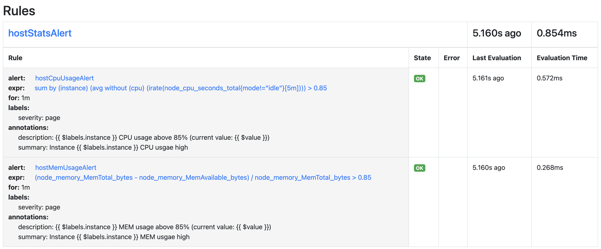

切换到Alerts标签http://yourserverIP:9090/alerts可以查看当前告警的活动状态。

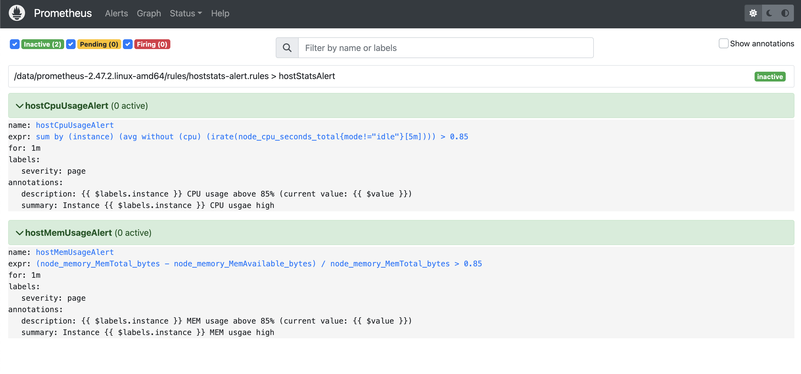

##### 触发测试

手动拉起cpu

```
cat /dev/zero>/dev/null
```

查看监控

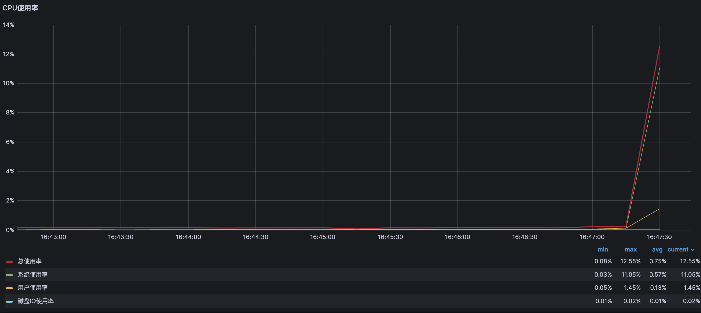

持续1m后查看告警状态，已触发

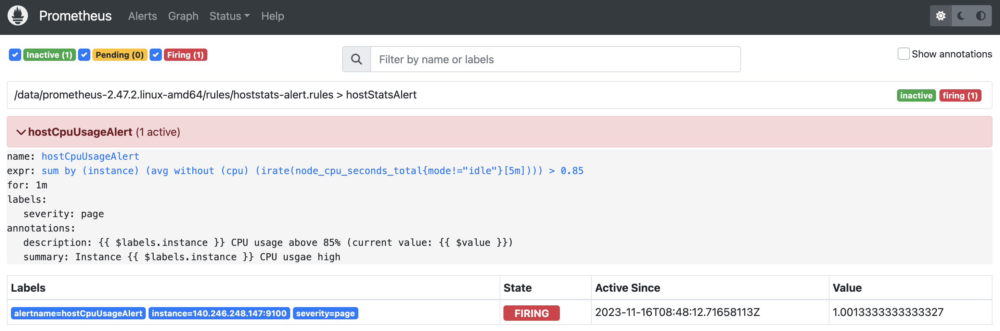

### 部署Alertmanager

Alertmanager和Prometheus Server一样均采用Golang实现，并且没有第三方依赖。一般来说我们可以通过以下几种方式来部署Alertmanager：二进制包、容器以及源码方式安装。

#### 安装包部署

Alertmanager最新版本的下载地址可以从Prometheus官方网站https://prometheus.io/download/获取

解压安装包

```shell
tar -xvf tar -xvf alertmanager-0.26.0.linux-amd64.tar.gz
```

查看配置文件

配置文件构成

Alertmanager的配置主要包含两个部分：路由(route)以及接收器(receivers)。所有的告警信息都会从配置中的顶级路由(route)进入路由树，根据路由规则将告警信息发送给相应的接收器。

```yaml
global:
  resolve_timeout: 5m
route:
  group_by: ['alertname']
  group_wait: 10s
  group_interval: 10s
  repeat_interval: 1h
  receiver: 'web.hook'
receivers:
- name: 'web.hook'
  webhook_configs:
  - url: 'http://127.0.0.1:5001/'
inhibit_rules:
  - source_match:
      severity: 'critical'
    target_match:
      severity: 'warning'
    equal: ['alertname', 'dev', 'instance']
```

启动服务

用户也在启动Alertmanager时使用参数修改相关配置。`--config.file`用于指定alertmanager配置文件路径，`--storage.path`用于指定数据存储路径。

```
nohup ./alertmanager &
```

查看运行状态

Alertmanager启动后可以通过9093端口访问，http://youserverip:9093

Alert菜单下可以查看Alertmanager接收到的告警内容。Silences菜单下则可以通过UI创建静默规则，这部分我们会在后续部分介绍。进入Status菜单，可以看到当前系统的运行状态以及配置信息。

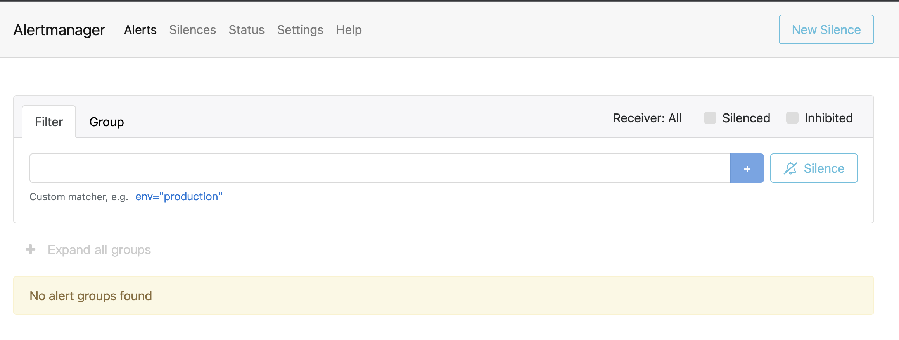

#### 关联Prometheus与Alertmanager

在Prometheus的架构中被划分成两个独立的部分。Prometheus负责产生告警，而Alertmanager负责告警产生后的后续处理。因此Alertmanager部署完成后，需要在Prometheus中设置Alertmanager相关的信息。

编辑Prometheus配置文件prometheus.yml,并添加以下内容

```yaml
alerting:
  alertmanagers:
    - static_configs:
        - targets: ['localhost:9093']
```

重启Prometheus服务，成功后，可以从http://youserverip:9090/config查看alerting配置是否生效。

手动拉起CPU，等待告警触发

```shell
cat /dev/zero>/dev/null
```

通过9093端口访问，http://youserverip:9093，查看告警是否关联成功

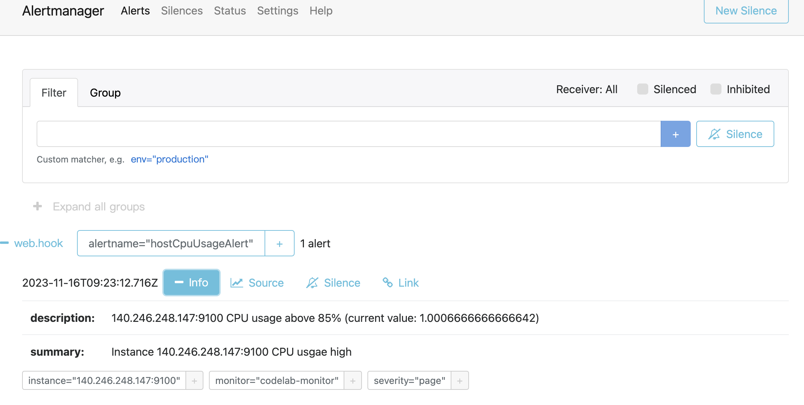

### 配置Alertmanager

Alertmanager中通过路由(Route)来定义告警的处理方式

Alertmanager主要负责对Prometheus产生的告警进行统一处理，因此在Alertmanager配置中一般会包含以下几个主要部分：

- 全局配置（global）：用于定义一些全局的公共参数，如全局的SMTP配置，Slack配置等内容；
- 模板（templates）：用于定义告警通知时的模板，如HTML模板，邮件模板等；
- 告警路由（route）：根据标签匹配，确定当前告警应该如何处理；
- 接收人（receivers）：接收人是一个抽象的概念，它可以是一个邮箱也可以是微信，Slack或者Webhook等，接收人一般配合告警路由使用；
- 抑制规则（inhibit_rules）：合理设置抑制规则可以减少垃圾告警的产生

完整配置实例

```yaml
global:
  [ resolve_timeout: <duration> | default = 5m ]
  [ smtp_from: <tmpl_string> ] 
  [ smtp_smarthost: <string> ] 
  [ smtp_hello: <string> | default = "localhost" ]
  [ smtp_auth_username: <string> ]
  [ smtp_auth_password: <secret> ]
  [ smtp_auth_identity: <string> ]
  [ smtp_auth_secret: <secret> ]
  [ smtp_require_tls: <bool> | default = true ]
  [ slack_api_url: <secret> ]
  [ victorops_api_key: <secret> ]
  [ victorops_api_url: <string> | default = "https://alert.victorops.com/integrations/generic/20131114/alert/" ]
  [ pagerduty_url: <string> | default = "https://events.pagerduty.com/v2/enqueue" ]
  [ opsgenie_api_key: <secret> ]
  [ opsgenie_api_url: <string> | default = "https://api.opsgenie.com/" ]
  [ hipchat_api_url: <string> | default = "https://api.hipchat.com/" ]
  [ hipchat_auth_token: <secret> ]
  [ wechat_api_url: <string> | default = "https://qyapi.weixin.qq.com/cgi-bin/" ]
  [ wechat_api_secret: <secret> ]
  [ wechat_api_corp_id: <string> ]
  [ http_config: <http_config> ]

templates:
  [ - <filepath> ... ]

route: <route>

receivers:
  - <receiver> ...

inhibit_rules:
  [ - <inhibit_rule> ... ]
```

#### 告警路由

在Alertmanager的配置中会定义一个基于标签匹配规则的告警路由树，以确定在接收到告警后Alertmanager需要如何对其进行处理：

```
route: <route>
```

将匹配到的告警发送给哪一个receiver，一个最简单的route定义如下所示：

```yaml
route:
  group_by: ['alertname']
  receiver: 'web.hook'
receivers:
- name: 'web.hook'
  webhook_configs:
  - url: 'http://127.0.0.1:5001/'
```

上述配置中，我们只定义了一个路由，那就意味着所有由Prometheus产生的告警在发送到Alertmanager之后都会通过名为`web.hook`的receiver接收。这里的web.hook定义为一个webhook地址。

告警处理可不是这么简单的一件事情，对于不同级别的告警，我们可能会有完全不同的处理方式，因此在route中，我们还可以定义更多的子Route，这些Route通过标签匹配告警的处理方式

```yaml
[ receiver: <string> ]
[ group_by: '[' <labelname>, ... ']' ]
[ continue: <boolean> | default = false ]

match:
  [ <labelname>: <labelvalue>, ... ]

match_re:
  [ <labelname>: <regex>, ... ]

[ group_wait: <duration> | default = 30s ]
[ group_interval: <duration> | default = 5m ]
[ repeat_interval: <duration> | default = 4h ]

routes:
  [ - <route> ... ]
```

#### 路由匹配

每一个告警都会从配置文件中顶级的route进入路由树，需要注意的是顶级的route必须匹配所有告警(即不能有任何的匹配设置match和match_re)，每一个子路由可以定义自己的接收人和匹配规则。

默认情况下，告警进入到顶级route后会遍历所有的子节点，直到找到最深的匹配route，并将告警发送到该route定义的receiver中。

但如果route中设置**continue**的值为false，那么告警在匹配到第一个子节点之后就直接停止。

其中告警的匹配有两种方式可以选择。一种方式基于字符串验证，通过设置**match**规则判断当前告警中是否存在标签labelname并且其值等于labelvalue。第二种方式则基于正则表达式，通过设置**match_re**验证当前告警标签的值是否满足正则表达式的内容。

如果警报已经成功发送通知, 如果想设置发送告警通知之前要等待时间，则可以通过**repeat_interval**参数进行设置。

#### 告警分组

**group_by**来定义分组规则。基于告警中包含的标签，如果满足**group_by**中定义标签名称，那么这些告警将会合并为一个通知发送给接收器。

**group_wait**参数设置等待时间，如果在等待时间内，当前group接收到了新的告警，这些告警将会合并为一个通知向receiver发送。

**group_interval**配置，则用于定义相同的Group之间发送告警通知的时间间隔。

例如，当使用Prometheus监控多个集群以及部署在集群中的应用和数据库服务，并且定义以下的告警处理路由规则来对集群中的异常进行通知。

```
route:
  receiver: 'default-receiver'
  group_wait: 30s
  group_interval: 5m
  repeat_interval: 4h
  group_by: [cluster, alertname]
  routes:
  - receiver: 'database-pager'
    group_wait: 10s
    match_re:
      service: mysql|cassandra
  - receiver: 'frontend-pager'
    group_by: [product, environment]
    match:
      team: frontend
```

默认情况下所有的告警都会发送给集群管理员default-receiver，因此在Alertmanager的配置文件的根路由中，对告警信息按照集群以及告警的名称对告警进行分组。

如果告警时来源于数据库服务如MySQL或者Cassandra，此时则需要将告警发送给相应的数据库管理员(database-pager)。这里定义了一个单独子路由，如果告警中包含service标签，并且service为MySQL或者Cassandra,则向database-pager发送告警通知，由于这里没有定义group_by等属性，这些属性的配置信息将从上级路由继承，database-pager将会接收到按cluster和alertname进行分组的告警通知。

而某些告警规则可能来源于开发团队的定义，这些告警中通过添加标签team来标示这些告警的创建者。在Alertmanager配置文件的告警路由下，定义单独子路由用于处理这一类的告警通知，如果匹配到告警中包含标签team，并且team的值为frontend，Alertmanager将会按照标签product和environment对告警进行分组。

#### 告警接收

Alertmanager中路由负责对告警信息进行分组匹配，并将像告警接收器发送通知。告警接收器可以通过以下形式进行配置：

```yaml
receivers:
  - <receiver> ...
```

每一个receiver具有一个全局唯一的名称，并且对应一个或者多个通知方式：

```shell
name: <string>
email_configs:
  [ - <email_config>, ... ]
hipchat_configs:
  [ - <hipchat_config>, ... ]
pagerduty_configs:
  [ - <pagerduty_config>, ... ]
pushover_configs:
  [ - <pushover_config>, ... ]
slack_configs:
  [ - <slack_config>, ... ]
opsgenie_configs:
  [ - <opsgenie_config>, ... ]
webhook_configs:
  [ - <webhook_config>, ... ]
victorops_configs:
  [ - <victorops_config>, ... ]
```

##### 邮件

在Alertmanager使用邮箱通知，用户只需要定义好SMTP相关的配置，并且在receiver中定义接收方的邮件地址即可。在Alertmanager中我们可以直接在配置文件的global中定义全局的SMTP配置：

```yaml
global:
  [ smtp_from: <tmpl_string> ]
  [ smtp_smarthost: <string> ]
  [ smtp_hello: <string> | default = "localhost" ]
  [ smtp_auth_username: <string> ]
  [ smtp_auth_password: <secret> ]
  [ smtp_auth_identity: <string> ]
  [ smtp_auth_secret: <secret> ]
  [ smtp_require_tls: <bool> | default = true ]
```

完成全局SMTP之后，我们只需要为receiver配置email_configs用于定义一组接收告警的邮箱地址即可，如下所示：

```yaml
name: <string>
email_configs:
  [ - <email_config>, ... ]
```

每个email_config中定义相应的接收人邮箱地址，邮件通知模板等信息即可，当然如果当前接收人需要单独的SMTP配置，那直接在email_config中覆盖即可：

```yaml
[ send_resolved: <boolean> | default = false ]
to: <tmpl_string>
[ html: <tmpl_string> | default = '{{ template "email.default.html" . }}' ]
[ headers: { <string>: <tmpl_string>, ... } ]
```

如果当前收件人需要接受告警恢复的通知的话，在email_config中定义`send_resolved`为true即可。

如果所有的邮件配置使用了相同的SMTP配置，则可以直接定义全局的SMTP配置。

示例：配置QQ邮箱

前提：首先获取QQ邮箱的SMTP授权码

```yaml
global:
  smtp_smarthost: smtp.qq.com:587
  smtp_from: 153464630@qq.com
  smtp_auth_username: 153464630@qq.com
  ##smtp_auth_identity: <username>
  smtp_auth_password: shpspjqtvekcbidd 
route:
  group_by: ['alertname']
  receiver: 'default-receiver'
receivers:
  - name: default-receiver
    email_configs:
      - to: 153464630@qq.com
        send_resolved: true
```

模拟CPU告警

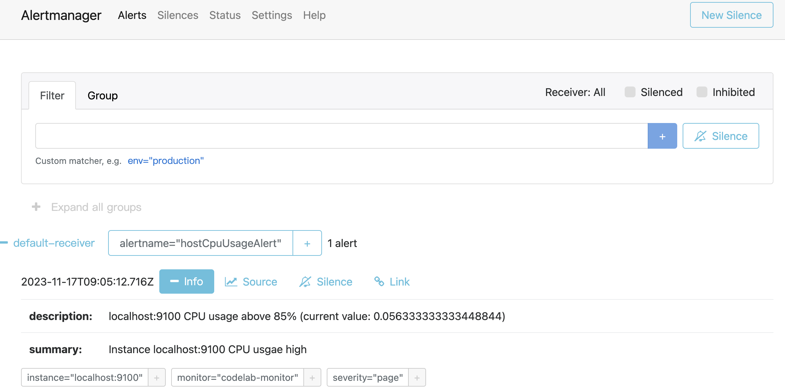

查看邮件

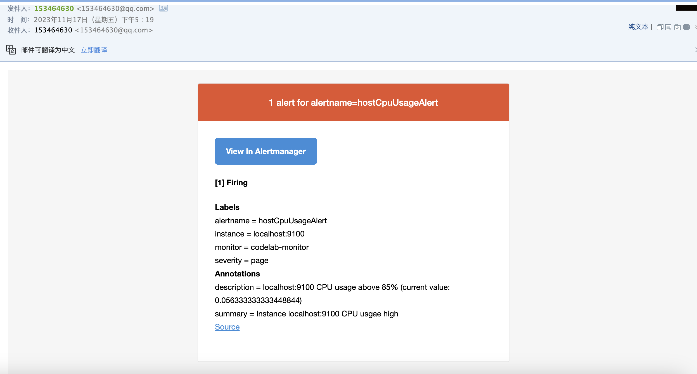

##### Webhook(企业微信)

###### 部署消息中转服务adapter

通过docker-compose管理

```shell
vim docker-compose 
```

```dockerfile
version: '3'
services:
  webhook-adapter:
    image: guyongquan/webhook-adapter:latest
version: '3'
services:
  webhook-adapter:
    image: guyongquan/webhook-adapter:latest
    container_name: webhook-adapter
    hostname: webhook-adapter
    ports:
      - "8089:80"
    restart: always
    command:
      - "--adapter=/app/prometheusalert/wx.js=/wx=https://qyapi.weixin.qq.com/cgi-bin/webhook/send?key=ddcebdbc-*******"
#/wx=后面是匹配企业微信机器人的webhook地址
```

```shell
#启动
docker-compose -d up
```

访问验证地址

```shell
http://124.220.15.126:8089/
```

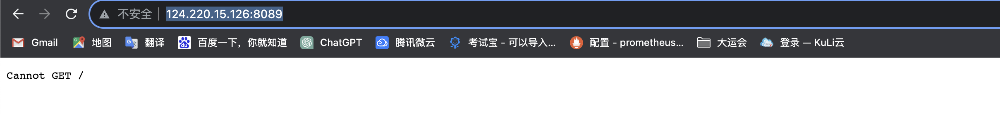

###### 编辑Alertmanger配置文件

```yaml
global:
  resolve_timeout: 5m
#templates:
#   - '/export/alertmanager/template/*.tmpl'
   #这里要加载template的文件
# 定义路由树信息
route:
  group_by: ['alertname']
  group_wait: 10s
  group_interval: 1m
  repeat_interval: 30m  #重复时间
  receiver: 'prometheus'   #这里的名称要上下一致
  routes:
  - receiver: 'prometheus'  #同上一致
    group_wait: 60s
    match:
      level: '1'
receivers:
    - name: 'prometheus'  #同上一致
      webhook_configs:
      - url: 'http://10.11.0.16:8089/adapter/wx'  #这里的配置是调用adapter服务的接口
         # 匹配adapter的接口，匹配企业微信prometheus机器人
        send_resolved: true
#抑制规则
inhibit_rules:
  - source_match:
      severity: 'critical'
    target_match:
      severity: 'warning'
    equal: ['alertname', 'dev', 'instance']
```

重启Alertmanger服务

```shell
sh restart.sh
```

重启脚本示例

```shell
#! /bin/bash
ps aux | grep alertmanager | grep -v grep | awk {'print$2'} | xargs kill
nohup ./alertmanager &
sleep 1s
ps aux | grep alertmanager | grep -v grep
```

###### 模拟验证

手动拉起CPU

```shell
cat /dev/zero>/dev/null
```

验证告警是否触发

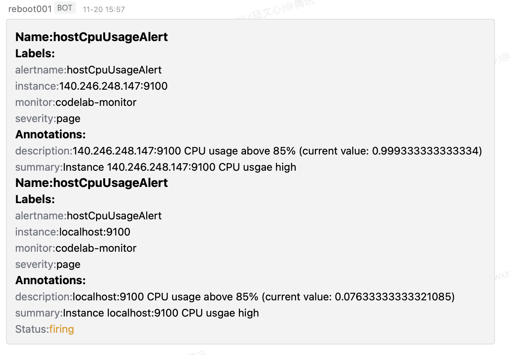

#### 告警模版

##### 模版字符串

第一种，基于模板字符串。用户可以直接在Alertmanager的配置文件中使用模板字符串，例如:

```yaml
receivers:
- name: 'slack-notifications'
  slack_configs:
  - channel: '#alerts'
    text: 'https://internal.myorg.net/wiki/alerts/{{ .GroupLabels.app }}/{{ .GroupLabels.alertname }}'
```

##### 自定义模版文件

通过在Alertmanager的全局设置中定义templates配置来指定自定义模板的访问路径:

```yaml
# Files from which custom notification template definitions are read.
# The last component may use a wildcard matcher, e.g. 'templates/*.tmpl'.
templates:
  [ - <filepath> ... ]
```

在设置了自定义模板的访问路径后，用户则可以直接在配置中使用该模板：

```yaml
receivers:
- name: 'slack-notifications'
  slack_configs:
  - channel: '#alerts'
    text: '{{ template "slack.myorg.text" . }}'

templates:
- '/etc/alertmanager/templates/myorg.tmpl'
```

#### 屏蔽告警通知

##### 抑制机制

通过抑制机制来确定重大告警通知，避免重复无用告警

例如当集群不可用时，用户可能只希望接收到一条告警，告诉他这时候集群出现了问题，而不是大量的如集群中的应用异常、中间件服务异常的告警通知。

在Alertmanager配置文件中，使用inhibit_rules定义一组告警的抑制规则：

```yaml
inhibit_rules:
  [ - <inhibit_rule> ... ]
```

每一条抑制规则的具体配置如下：

```yaml
target_match:
  [ <labelname>: <labelvalue>, ... ]
target_match_re:
  [ <labelname>: <regex>, ... ]

source_match:
  [ <labelname>: <labelvalue>, ... ]
source_match_re:
  [ <labelname>: <regex>, ... ]

[ equal: '[' <labelname>, ... ']' ]
```

当已经发送的告警通知匹配到target_match和target_match_re规则，当有新的告警规则如果满足source_match或者定义的匹配规则，并且已发送的告警与新产生的告警中equal定义的标签完全相同，则启动抑制机制，新的告警不会发送。

例如，定义如下抑制规则：

```yaml
- source_match:
    alertname: NodeDown
    severity: critical
  target_match:
    severity: critical
  equal:
    - node
```

例如当集群中的某一个主机节点异常宕机导致告警NodeDown被触发，同时在告警规则中定义了告警级别severity=critical。由于主机异常宕机，该主机上部署的所有服务，中间件会不可用并触发报警。根据抑制规则的定义，如果有新的告警级别为severity=critical，并且告警中标签node的值与NodeDown告警的相同，则说明新的告警是由NodeDown导致的，则启动抑制机制停止向接收器发送通知。

##### 临时静默

用户可以通过UI来临时屏蔽特定的告警通知

过定义标签的匹配规则(字符串或者正则表达式)，如果新的告警通知满足静默规则的设置，则停止向receiver发送通知。

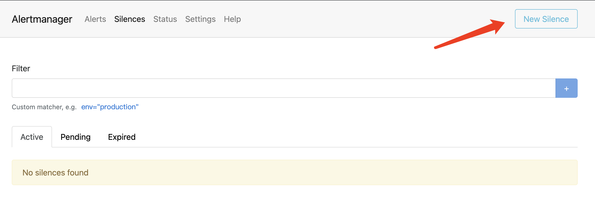

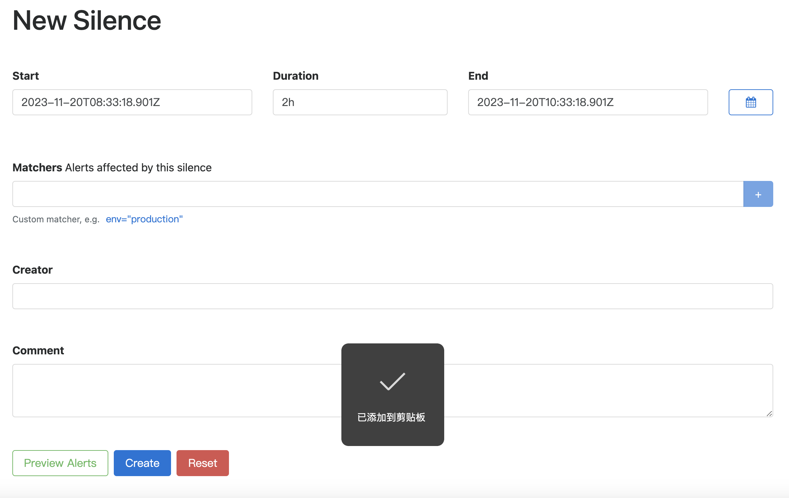

用户可以通过该UI定义新的静默规则的开始时间以及持续时间，通过Matchers部分可以设置多条匹配规则(字符串匹配或者正则匹配)。填写当前静默规则的创建者以及创建原因后，点击"Create"按钮即可。

对于已经生效的规则，用户可以通过手动点击“Expire”按钮使当前规则过期。


### 集群与高可用

#### 本地存储

##### 常见配置

用户可以通过命令行启动参数的方式修改本地存储的配置。

| 启动参数                         | 默认值 | 含义                                                         |
| :------------------------------- | :----- | :----------------------------------------------------------- |
| –storage.tsdb.path               | data/  | Base path for metrics storage                                |
| –storage.tsdb.retention          | 15d    | How long to retain samples in the storage                    |
| –storage.tsdb.min-block-duration | 2h     | The timestamp range of head blocks after which they get persisted |
| –storage.tsdb.max-block-duration | 36h    | The maximum timestamp range of compacted blocks,It’s the minimum duration of any persisted block. |
| –storage.tsdb.no-lockfile        | false  | Do not create lockfile in data directory                     |

在一般情况下，Prometheus中存储的每一个样本大概占用1-2字节大小。如果需要对Prometheus Server的本地磁盘空间做容量规划时，可以通过以下公式计算：

```txt
needed_disk_space = retention_time_seconds * ingested_samples_per_second * bytes_per_sample
```

##### 从失败中恢复

如果本地存储由于某些原因出现了错误，最直接的方式就是停止Prometheus并且删除data目录中的所有记录。当然也可以尝试删除那些发生错误的块目录，不过相应的用户会丢失该块中保存的大概两个小时的监控记录。

#### 远程存储

Prometheus的本地存储设计可以减少其自身运维和管理的复杂度，同时能够满足大部分用户监控规模的需求。但是本地存储也意味着Prometheus无法持久化数据，无法存储大量历史数据，同时也无法灵活扩展和迁移。

为了保持Prometheus的简单性，Prometheus并没有尝试在自身中解决以上问题，而是通过定义两个标准接口(remote_write/remote_read)，让用户可以基于这两个接口对接将数据保存到任意第三方的存储服务中，这种方式在Prometheus中称为Remote Storage。

##### Remote Write

用户可以在Prometheus配置文件中指定Remote Write(远程写)的URL地址，一旦设置了该配置项，Prometheus将采集到的样本数据通过HTTP的形式发送给适配器(Adaptor)。而用户则可以在适配器中对接外部任意的服务。外部服务可以是真正的存储系统，公有云的存储服务，也可以是消息队列等任意形式。

##### Remote Read

Prometheus的Remote Read(远程读)也通过了一个适配器实现。在远程读的流程当中，当用户发起查询请求后，Prometheus将向remote_read中配置的URL发起查询请求(matchers,ranges)，Adaptor根据请求条件从第三方存储服务中获取响应的数据。同时将数据转换为Prometheus的原始样本数据返回给Prometheus Server。

##### 配置文件

remote_write和remote_read具体配置如下所示：

```yaml
remote_write:
    url: <string>
    [ remote_timeout: <duration> | default = 30s ]
    write_relabel_configs:
    [ - <relabel_config> ... ]
    basic_auth:
    [ username: <string> ]
    [ password: <string> ]
    [ bearer_token: <string> ]
    [ bearer_token_file: /path/to/bearer/token/file ]
    tls_config:
    [ <tls_config> ]
    [ proxy_url: <string> ]

remote_read:
    url: <string>
    required_matchers:
    [ <labelname>: <labelvalue> ... ]
    [ remote_timeout: <duration> | default = 30s ]
    [ read_recent: <boolean> | default = false ]
    basic_auth:
    [ username: <string> ]
    [ password: <string> ]
    [ bearer_token: <string> ]
    [ bearer_token_file: /path/to/bearer/token/file ]
    [ <tls_config> ]
    [ proxy_url: <string> ]
```

##### 远程存储方案 InfluxDB

安装包部署InfluxDB

```shell
cd /data
mkdir influxDB
wget  https://dl.influxdata.com/influxdb/releases/influxdb-1.8.0.x86_64.rpm
yum -y localinstall influxdb-1.8.0.x86_64.rpm
systemctl start influxdb
```

创建prometheus库

```sql
influx
create database prometheus
show databases
```

添加读写配置到prometheus

```yaml
remote_write:
 - url: "http://127.0.0.1:8086/api/v1/prom/write?db=prometheus"
remote_read:
 - url: "http://127.0.0.1:8086/api/v1/prom/read?db=prometheus"
```

重启

```bash
# 重启
systemctl restart prometheus
# 查看状态
systemctl status prometheus
```

切换到influxdb内验证

```sql
influx
use prometheus
show measurements
```

指标已写入

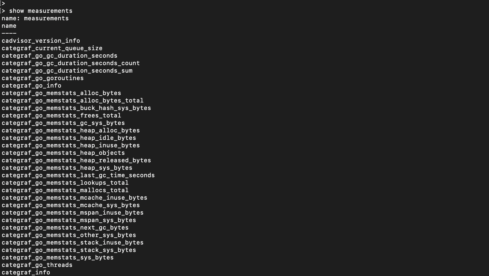

##### influx鉴权

初始influxdb不需要验证即可使用，出于安全考虑应当设置密码

```yaml
#开启http配置验证权限
[http]
auth-enabled = true
```

创建用户（相关命令）

```sql
# 显示用户
SHOW USERS
# 创建用户
CREATE USER "username" WITH PASSWORD 'password'
# 赋予用户管理员权限
GRANT ALL PRIVILEGES TO username
# 创建管理员权限的用户
CREATE USER <username> WITH PASSWORD '<password>' WITH ALL PRIVILEGES
# 修改用户密码
SET PASSWORD FOR username = 'password'
# 撤消权限
REVOKE ALL ON mydb FROM username
# 查看权限
SHOW GRANTS FOR username
# 删除用户
DROP USER "username"
```

```sql
> show users
user admin
---- -----
> 
> 
> create user "root" with password 'Tcdn@2007'
> 
> 
> 
> show users
user admin
---- -----
root false
> 
> 
> 
> GRANT ALL PRIVILEGES TO root
> 
> 
> show users
user admin
---- -----
root true
> 
```

重启influxdb

```shell
systemctl restart influxdb
```

权限设置成功

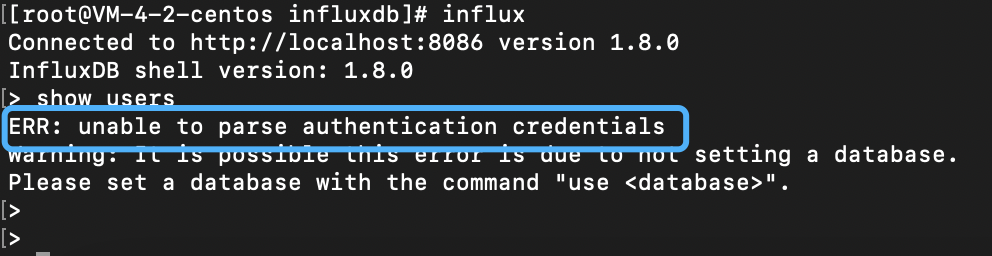

配置prometheus读写账号和密码

```yaml
remote_write:
 - url: "http://127.0.0.1:8086/api/v1/prom/write?db=prometheus&u=root&p=Tcdn@2007"
remote_read:
 - url: "http://127.0.0.1:8086/api/v1/prom/read?db=prometheus&u=root&p=Tcdn@2007"
```

重启prometheus验证监控数据是否正常

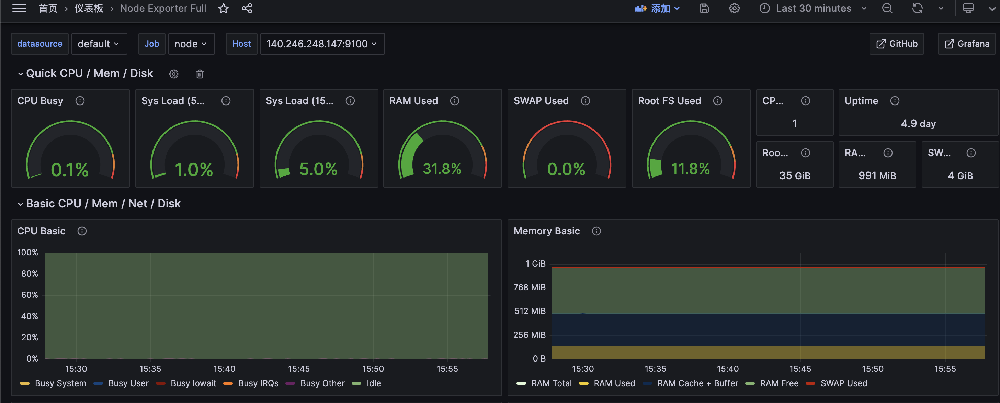

#### 联邦集群

对于大部分监控规模而言，我们只需要在每一个数据中心(例如：EC2可用区，Kubernetes集群)安装一个Prometheus Server实例，就可以在各个数据中心处理上千规模的集群。同时将Prometheus Server部署到不同的数据中心可以避免网络配置的复杂性。


联邦集群的特性可以帮助用户根据不同的监控规模对Prometheus部署架构进行调整。例如如下所示，可以在各个数据中心中部署多个Prometheus Server实例。每一个Prometheus Server实例只负责采集当前数据中心中的一部分任务(Job)，例如可以将不同的监控任务分离到不同的Prometheus实例当中，再有中心Prometheus实例进行聚合。

#### 高可用实例

***基本HA：服务可用性***

由于Prometheus的Pull机制的设计，为了确保Prometheus服务的可用性，用户只需要部署多套Prometheus Server实例，并且采集相同的Exporter目标即可。

基本的HA模式只能确保Prometheus服务的可用性问题，但是不解决Prometheus Server之间的数据一致性问题以及持久化问题(数据丢失后无法恢复)，也无法进行动态的扩展。因此这种部署方式适合监控规模不大，Prometheus Server也不会频繁发生迁移的情况，并且只需要保存短周期监控数据的场景。

***基本HA+远程存储***

在基本HA模式的基础上通过添加Remote Storage存储支持，将监控数据保存在第三方存储服务上。

在解决了Prometheus服务可用性的基础上，同时确保了数据的持久化，当Prometheus Server发生宕机或者数据丢失的情况下，可以快速的恢复。 同时Prometheus Server可能很好的进行迁移。因此，该方案适用于用户监控规模不大，但是希望能够将监控数据持久化，同时能够确保Prometheus Server的可迁移性的场景。

***基本HA+远程存储+联邦集群***

当单台Prometheus Server无法处理大量的采集任务时，用户可以考虑基于Prometheus联邦集群的方式将监控采集任务划分到不同的Prometheus实例当中即在任务级别功能分区。

场景一：单数据中心 + 大量的采集任务

这种场景下Prometheus的性能瓶颈主要在于大量的采集任务，因此用户需要利用Prometheus联邦集群的特性，将不同类型的采集任务划分到不同的Prometheus子服务中，从而实现功能分区。例如一个Prometheus Server负责采集基础设施相关的监控指标，另外一个Prometheus Server负责采集应用监控指标。再有上层Prometheus Server实现对数据的汇聚。

场景二：多数据中心

这种模式也适合与多数据中心的情况，当Prometheus Server无法直接与数据中心中的Exporter进行通讯时，在每一个数据中部署一个单独的Prometheus Server负责当前数据中心的采集任务是一个不错的方式。这样可以避免用户进行大量的网络配置，只需要确保主Prometheus Server实例能够与当前数据中心的Prometheus Server通讯即可。 中心Prometheus Server负责实现对多数据中心数据的聚合。

#### 高可用部署（HA+远程存储）

##### 服务器规划

服务器A 

```
prometheus+influxdb+alertmanger+nginx
```

服务器B

```
prometheus+alertmanger
```

##### prometheus+influxdb部署

见上文

编辑服务器B的配置文件，由于服务器B只需从远程存储中读取时序数据，配置文件中仅需注明数据源即可，其余同服务器A

```yaml
global:
  scrape_interval:     15s # 默认情况下，每 15s 采集一次目标数据
  # 与外部系统(如 federation, remote storage, Alertmanager)通信时，可以将这些标签应用到到和时间序列或告警上
  external_labels:
    monitor: 'codelab-monitor'
rule_files:
  - /data/prometheus-2.47.2.linux-amd64/rules/*.rules
alerting:
  alertmanagers:
    - static_configs:
        - targets: ['localhost:9093','124.220.15.126:9093']
#remote_write:
# - url: "http://127.0.0.1:8086/api/v1/prom/write?db=prometheus&u=root&p=Tcdn@2007"
remote_read:
 - url: "http://124.220.15.126:8086/api/v1/prom/read?db=prometheus&u=root&p=Tcdn@2007"
# 仅包含一个采集端点的采集配置：这里是 Prometheus 本身
scrape_configs:
  # 作业名称作为标签 `job=<job_name>` 添加到从此配置中采集的时间序列上
  - job_name: 'prometheus'
    # 覆盖全局默认的参数，并将采样时间间隔设置为 5s
    scrape_interval: 5s
    static_configs:
      - targets: ['localhost:9090']
  - job_name: 'node'
    static_configs:
      - targets: [
                'localhost:9100',
                '124.220.15.126:9100'
                ]
  - job_name: 'blackbox_get'
    metrics_path: /probe
    params:
      module: [http_2xx]  # Blackbox Exporter 模块配置，可以添加更多的模块
    static_configs:
      - targets:
        - http://124.220.15.126:9093
        - http://124.220.15.126:3000
    relabel_configs:
      - source_labels: [__address__]
        target_label: __param_target
      - source_labels: [__param_target]
        target_label: instance
      - target_label: __address__
        replacement: 124.220.15.126:9115 # Blackbox Exporter 的地址
  - job_name: 'blackbox_post'
    metrics_path: /probe
    params:
      module: [http_post_2xx]  # Blackbox Exporter 模块配置，可以添加更多的模块
    static_configs:
      - targets:
        - https://qyapi.weixin.qq.com/cgi-bin/webhook/send?key=c7305ec5-ad97-4da2-82e7-edaf546238ab
    relabel_configs:
      - source_labels: [__address__]
        target_label: __param_target
      - source_labels: [__param_target]
        target_label: instance
      - target_label: __address__
        replacement: 124.220.15.126:9115 # Blackbox Exporter 的地址
  - job_name: cadvisor
    static_configs:
    - targets:
      - 124.220.15.126:8081
  - job_name: mysqld
    static_configs:
    - targets:
      - 124.220.15.126:9104
```

> 为保证服务继续可用，服务器B需正常配置target采集服务到本地

##### nginx部署

```shell
yum install nginx -y
cd /etc/nginx
mv nginx.conf nginx.conf.bak
vim nginx.conf
#nginx配置文件
events {
    worker_connections 1024;
}

http {
    log_format main '$remote_addr - $remote_user [$time_local] "$request" '
                      '$status $body_bytes_sent "$http_referer" '
                      '"$http_user_agent" "$http_x_forwarded_for"';
    access_log /var/log/nginx/access.log main;
    error_log /var/log/nginx/error.log;
    upstream prometheus_servers {
        server 124.220.15.126:9090;  # 服务器 A
        server 140.246.248.147:9090;  # 服务器 B
    }
    server {
        listen 80;
        server_name 124.220.15.126;  # 使用 Server A 的公网 IP 替换
        location / {
            proxy_pass http://prometheus_servers;
            proxy_set_header Host $host;
            proxy_set_header X-Real-IP $remote_addr;
            proxy_set_header X-Forwarded-For $proxy_add_x_forwarded_for;
            proxy_set_header X-Forwarded-Proto $scheme;
	          add_header X-Route-Ip $upstream_addr; #显示当前请求分发IP地址
	          add_header X-Route-Status $upstream_status;
        }
    }
    
    # ... 其他配置 ...

}

systemctl start nginx
```

##### 服务验证

```shell
#浏览器访问
http://124.220.15.126:80
#grafana配置
124.220.15.126:80
```

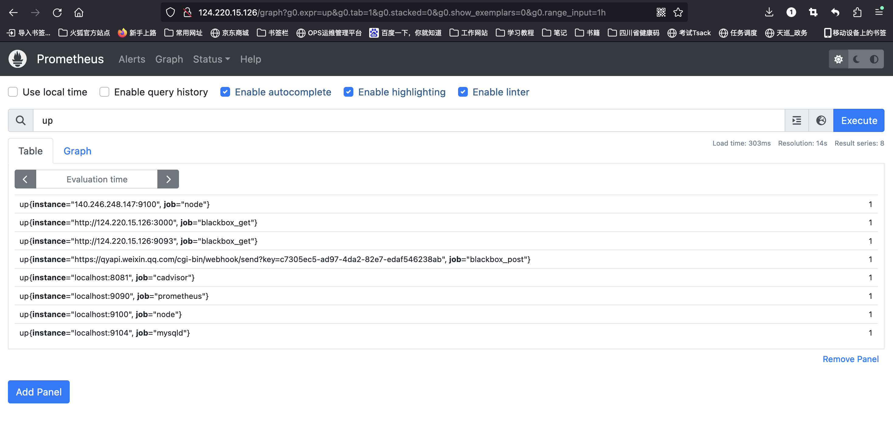

查看请求头，负载成功

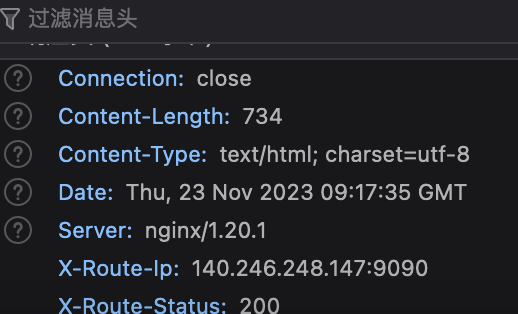

##### 模拟服务器B本地采集失效

```yaml
##去除所有采集target
global:
  scrape_interval:     15s # 默认情况下，每 15s 采集一次目标数据
  # 与外部系统(如 federation, remote storage, Alertmanager)通信时，可以将这些标签应用到到和时间序列或告警上
  external_labels:
    monitor: 'codelab-monitor'
rule_files:
  - /data/prometheus-2.47.2.linux-amd64/rules/*.rules
alerting:
  alertmanagers:
    - static_configs:
        - targets: ['localhost:9093','124.220.15.126:9093']
remote_read:
  - url: "http://124.220.15.126:8086/api/v1/prom/read?db=prometheus&u=root&p=Tcdn@2007"
    read_recent: true
```

验证服务正常

Target无配置

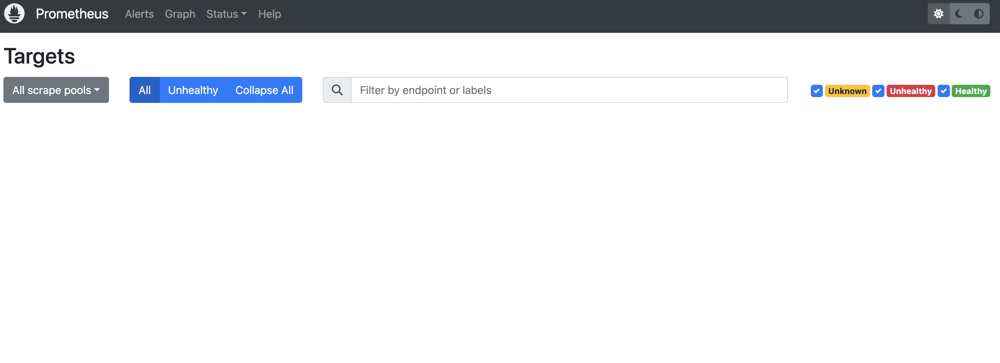


监控采集正常

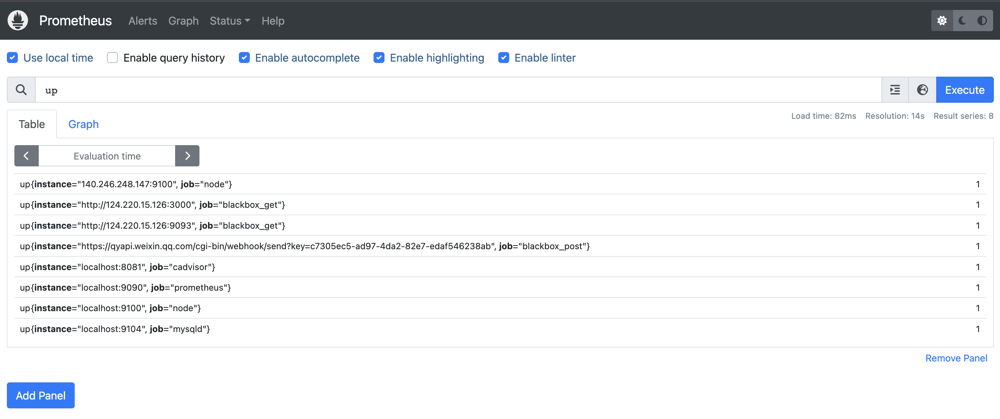

##### Alertmanger高可用

Alertmanager引入了Gossip机制。Gossip机制为多个Alertmanager之间提供了信息传递的机制。确保及时在多个Alertmanager分别接收到相同告警信息的情况下，也只有一个告警通知被发送给Receiver


Gossip是分布式系统中被广泛使用的协议，用于实现分布式节点之间的信息交换和状态同步。Gossip协议同步状态类似于流言或者病毒的传播，如下所示：


一般来说Gossip有两种实现方式分别为Push-based和Pull-based。在Push-based当集群中某一节点A完成一个工作后，随机的从其它节点B并向其发送相应的消息，节点B接收到消息后在重复完成相同的工作，直到传播到集群中的所有节点。而Pull-based的实现中节点A会随机的向节点B发起询问是否有新的状态需要同步，如果有则返回。


1. 在第一个阶段Silence中，Alertmanager会判断当前通知是否匹配到任何的静默规则，如果没有则进入下一个阶段，否则中断流水线不发送通知。
2. 在第二个阶段Wait中，Alertmanager会根据当前Alertmanager在集群中所在的顺序(index)等待index * 5s的时间。
3. 当前Alertmanager等待阶段结束后，Dedup阶段则会判断当前Alertmanager数据库中该通知是否已经发送，如果已经发送则中断流水线，不发送告警，否则进入下一阶段Send对外发送告警通知。
4. 告警发送完成后该Alertmanager进入最后一个阶段Gossip，Gossip会通知其他Alertmanager实例当前告警已经发送。其他实例接收到Gossip消息后，则会在自己的数据库中保存该通知已发送的记录。

Gossip机制的关键在于两点：

- Silence设置同步：Alertmanager启动阶段基于Pull-based从集群其它节点同步Silence状态，当有新的Silence产生时使用Push-based方式在集群中传播Gossip信息。
- 通知发送状态同步：告警通知发送完成后，基于Push-based同步告警发送状态。Wait阶段可以确保集群状态一致。

Alertmanager基于Gossip实现的集群机制虽然不能保证所有实例上的数据时刻保持一致，但是实现了CAP理论中的AP系统，即可用性和分区容错性。同时对于Prometheus Server而言保持了配置了简单性，Promthues Server之间不需要任何的状态同步。

##### Alertmanager配置

###### 编辑相同配置文件

```shell
vim alertmanger.yml
```

```yaml
global:
  resolve_timeout: 5m
route:
  group_by: ['alertname']
  receiver: 'webhook-receiver'
  group_wait: 10s
  group_interval: 1m
  repeat_interval: 30m
receivers:
  - name: 'webhook-receiver'
    webhook_configs:
      - url: 'http://124.220.15.126:8089/adapter/wx'
        send_resolved: true
```

###### 集群搭建

为了能够让Alertmanager节点之间进行通讯，需要在Alertmanager启动时设置相应的参数。其中主要的参数包括：

- –cluster.listen-address string: 当前实例集群服务监听地址
- –cluster.peer value: 初始化时关联的其它实例的集群服务地址

```shell
#机器A服务端口9093，集群端口9094
nohup ./alertmanager --web.listen-address=":9093" --cluster.listen-address="10.0.4.2:9094" --config.file=alertmanager.yml &
#机器B服务端口9093，集群端口9094，关联集群至服务器A:9094
nohup ./alertmanager --web.listen-address=":9093" --cluster.listen-address="192.168.0.40:9094"  --cluster.peer=124.220.15.126:9094  --config.file=alertmanager.yml &
```

> 分别登陆两台服务器9093查看配置状态，集群配置已生效

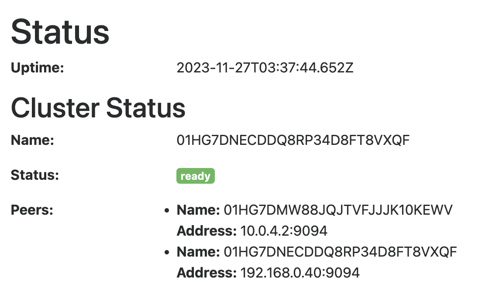

###### webhook推送测试

> 编辑测试脚本，分别推送至两台服务器

```shell
#!/usr/bin/env bash
alerts_message='[
  {
    "labels": {
       "alertname": "磁盘已满",
       "dev": "sda1",
       "instance": "实例sda1",
       "msgtype": "testing"
     },
     "annotations": {
        "info": "程序员提示您：这是测试消息",
        "summary": "testing"
      }
  }
]'
curl -XPOST -d"$alerts_message" http://124.220.15.126:9093/api/v1/alerts
curl -XPOST -d"$alerts_message" http://140.246.248.147:9093/api/v1/alerts
```

> 分别登陆两台服务器的9093地址查看告警均已推送

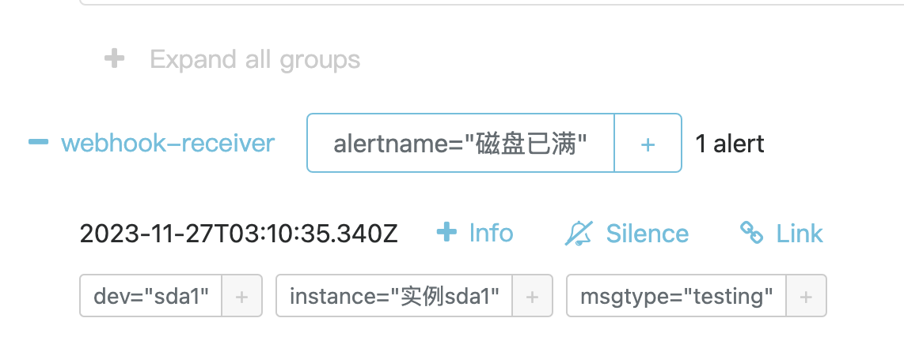

> 查看企业微信机器人webhook告警仅推送一条

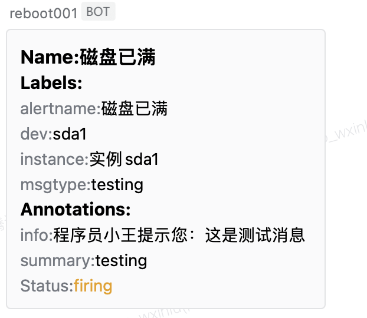


### Prometheus服务与发现

在基于云(IaaS或者CaaS)的基础设施环境中用户可以像使用水、电一样按需使用各种资源（计算、网络、存储）。按需使用就意味着资源的动态性，这些资源可以随着需求规模的变化而变化。例如在AWS中就提供了专门的AutoScall服务，可以根据用户定义的规则动态地创建或者销毁EC2实例，从而使用户部署在AWS上的应用可以自动的适应访问规模的变化。

这种按需的资源使用方式对于监控系统而言就意味着没有了一个固定的监控目标，所有的监控对象(基础设施、应用、服务)都在动态的变化。

对于Nagios这类基于Push模式传统监控软件就意味着必须在每一个节点上安装相应的Agent程序，并且通过配置指向中心的Nagios服务，受监控的资源与中心监控服务器之间是一个强耦合的关系，要么直接将Agent构建到基础设施镜像当中，要么使用一些自动化配置管理工具(如Ansible、Chef)动态的配置这些节点。当然实际场景下除了基础设施的监控需求以外，我们还需要监控在云上部署的应用，中间件等等各种各样的服务。要搭建起这样一套中心化的监控系统实施成本和难度是显而易见的。

Prometheus这一类基于Pull模式的监控系统，显然也无法继续使用的static_configs的方式静态的定义监控目标。而对于Prometheus而言其解决方案就是引入一个中间的代理人（服务注册中心），这个代理人掌握着当前所有监控目标的访问信息，Prometheus只需要向这个代理人询问有哪些监控目标即可， 这种模式被称为服务发现。


1. 在AWS公有云平台或者OpenStack的私有云平台中，Prometheus通过使用平台提供的API就可以找到所有需要监控的云主机。
2. 在Kubernetes这类容器管理平台中，Kubernetes掌握并管理着所有的容器以及服务信息，那此时Prometheus只需要与Kubernetes打交道就可以找到所有需要监控的容器以及服务对象。
3. Prometheus还可以直接与一些开源的服务发现工具进行集成，例如在微服务架构的应用程序中，经常会使用到例如Consul这样的服务发现注册软件，Promethues也可以与其集成从而动态的发现需要监控的应用服务实例。
4. Prometheus还支持基于DNS以及文件的方式动态发现监控目标，从而大大的减少了在云原生，微服务以及云模式下监控实施难度。

相较于Push模式，Pull模式的优点可以简单总结为以下几点：

- 只要Exporter在运行，你可以在任何地方（比如在本地），搭建你的监控系统；
- 你可以更容易的查看监控目标实例的健康状态，并且可以快速定位故障；
- 更利于构建DevOps文化的团队；
- 松耦合的架构模式更适合于云原生的部署环境。

#### 基于文件的服务发现

在Prometheus支持的众多服务发现的实现方式中，基于文件的服务发现是最通用的方式。这种方式不需要依赖于任何的平台或者第三方服务。

Prometheus会定时从文件中读取最新的Target信息，因此，你可以通过任意的方式将监控Target的信息写入即可。

##### 定义监控目标

通过json或者yaml文件定义所有的监控目标，使用env标签标示当前节点所在的环境

```json
[
  {
    "targets": [ "localhost:8081"],
    "labels": {
      "env": "localhost",
      "job": "cadvisor"
    }
  },
  {
    "targets": [ "localhost:9104" ],
    "labels": {
      "env": "prod",
      "job": "mysqld"
    }
  },
  {
    "targets": [ "localhost:9100"],
    "labels": {
      "env": "prod",
      "job": "node"
    }
  }
]
```

##### 编辑prometheus.yml

```yaml
global:
  scrape_interval: 15s
  scrape_timeout: 10s
  evaluation_interval: 15s
scrape_configs:
- job_name: 'file_ds'
  file_sd_configs:
  - files:
    - targets.json
```

这里定义了一个基于file_sd_configs的监控采集任务，其中模式的任务名称为file_ds。在JSON文件中可以使用job标签覆盖默认的job名称。

##### 重启Prometheus服务

```shell
systemctl restart prometheus.service
```

##### 查看UI Targets

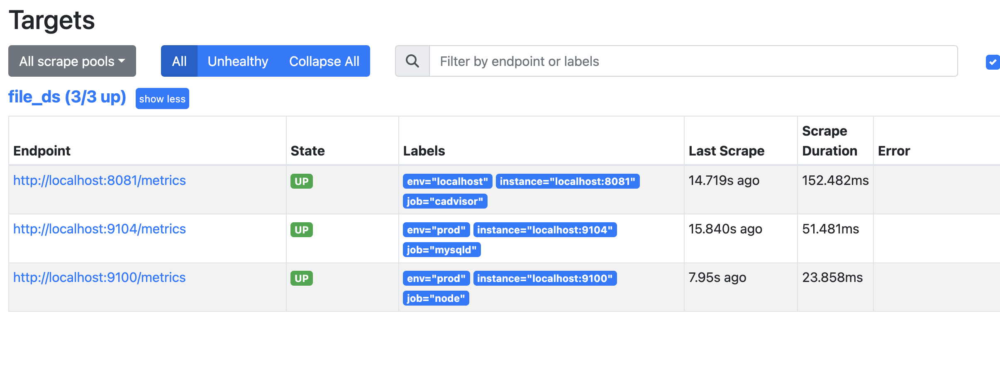

Prometheus默认每5m重新读取一次文件内容，当需要修改时，可以通过refresh_interval进行设置，例如：

```yaml
- job_name: 'file_ds'
  file_sd_configs:
  - refresh_interval: 1m
    files:
    - targets.json
```

通过这种方式，Prometheus会自动的周期性读取文件中的内容。当文件中定义的内容发生变化时，不需要对Prometheus进行任何的重启操作。

#### 基于consul的服务发现

##### Consul简单部署

```shell
##下载地址
https://www.consul.io/downloads.html
```

解压后复制到/user/bin

```shell
unzip consul_xxxxxx.zip
mv consul /user/bin/
```

本地启动单节点开发者模式

```shell
consul agent -dev
```

启动后查看所有节点

```shell
[root@test ~]# consul members
Node  Address         Status  Type    Build   Protocol  DC   Partition  Segment
test  127.0.0.1:8301  alive   server  1.17.0  2         dc1  default    <all>
```

通过http api模式查看节点信息

```shell
[root@test ~]# curl localhost:8500/v1/catalog/nodes
[
    {
        "ID": "045d34d8-2ef4-968e-8482-13d25a1e0414",
        "Node": "test",
        "Address": "127.0.0.1",
        "Datacenter": "dc1",
        "TaggedAddresses": {
            "lan": "127.0.0.1",
            "lan_ipv4": "127.0.0.1",
            "wan": "127.0.0.1",
            "wan_ipv4": "127.0.0.1"
        },
        "Meta": {
            "consul-network-segment": "",
            "consul-version": "1.17.0"
        },
        "CreateIndex": 11,
        "ModifyIndex": 17
    }
```

通过Consul的DNS服务的方式访问其中的节点

```SHELL
[root@test ~]# dig @127.0.0.1 -p 8600 localhost.node.consul

; <<>> DiG 9.11.4-P2-RedHat-9.11.4-26.P2.el7_9.15 <<>> @127.0.0.1 -p 8600 localhost.node.consul
; (1 server found)
;; global options: +cmd
;; Got answer:
;; ->>HEADER<<- opcode: QUERY, status: NXDOMAIN, id: 43677
;; flags: qr aa rd; QUERY: 1, ANSWER: 0, AUTHORITY: 1, ADDITIONAL: 1
;; WARNING: recursion requested but not available

;; OPT PSEUDOSECTION:
; EDNS: version: 0, flags:; udp: 4096
;; QUESTION SECTION:
;localhost.node.consul.         IN      A

;; AUTHORITY SECTION:
consul.                 0       IN      SOA     ns.consul. hostmaster.consul. 1701155574 3600 600 86400 0

;; Query time: 73 msec
;; SERVER: 127.0.0.1#8600(127.0.0.1)
;; WHEN: Tue Nov 28 15:12:54 CST 2023
;; MSG SIZE  rcvd: 100

```

##### Consul注册Node_exporter服务

在Consul当中服务可以通过服务定义文件或者是HTTP API的方式进行注册。这里使用服务定义文件的方式将本地运行的node_exporter通过服务的方式注册到Consul当中。

创建consul服务定义文件

```shell
mkdir /etc/consul.d
touch /etc/consul.d/node_exporter.json
vim node_exporter.json
```

```json
{
  "service": 
   {
    "name": "node_exporter", 
    "tags": ["exporter"], 
    "port": 9100
   }
}
```

重启consul并声明定义文件

```shell
### 默认启动方式
consul agent -dev -config-dir=/etc/consul.d
### 开启ui界面，开放至公网
consul agent -dev -config-dir=/etc/consul.d -client 192.168.0.40  -ui
###
```

**一旦服务注册成功之后，用户就可以通过DNS或HTTP API的方式查询服务信息。默认情况下，所有的服务都可以使用NAME.service.consul域名的方式进行访问。**

使用node_exporter.service.consul域名查询node_exporter服务的信息

```shell
[root@test consul.d]# dig @127.0.0.1 -p 8600 node_exporter.service.consul

; <<>> DiG 9.11.4-P2-RedHat-9.11.4-26.P2.el7_9.15 <<>> @127.0.0.1 -p 8600 node_exporter.service.consul
; (1 server found)
;; global options: +cmd
;; Got answer:
;; ->>HEADER<<- opcode: QUERY, status: NOERROR, id: 15323
;; flags: qr aa rd; QUERY: 1, ANSWER: 1, AUTHORITY: 0, ADDITIONAL: 1
;; WARNING: recursion requested but not available

;; OPT PSEUDOSECTION:
; EDNS: version: 0, flags:; udp: 4096
;; QUESTION SECTION:
;node_exporter.service.consul.  IN      A

;; ANSWER SECTION:
node_exporter.service.consul. 0 IN      A       127.0.0.1

;; Query time: 12 msec
;; SERVER: 127.0.0.1#8600(127.0.0.1)
;; WHEN: Tue Nov 28 15:23:32 CST 2023
;; MSG SIZE  rcvd: 73

```

使用HTTP API的形式获取服务列表

```shell
[root@test consul.d]# curl http://localhost:8500/v1/catalog/service/node_exporter
[
    {
        "ID": "36c35d1d-8388-657d-4807-dd0c0627cb7e",
        "Node": "test",
        "Address": "127.0.0.1",
        "Datacenter": "dc1",
        "TaggedAddresses": {
            "lan": "127.0.0.1",
            "lan_ipv4": "127.0.0.1",
            "wan": "127.0.0.1",
            "wan_ipv4": "127.0.0.1"
        },
        "NodeMeta": {
            "consul-network-segment": "",
            "consul-version": "1.17.0"
        },
        "ServiceKind": "",
        "ServiceID": "node_exporter",
        "ServiceName": "node_exporter",
        "ServiceTags": [
            "exporter"
        ],
        "ServiceAddress": "",
        "ServiceWeights": {
            "Passing": 1,
            "Warning": 1
        },
        "ServiceMeta": {},
        "ServicePort": 9100,
        "ServiceSocketPath": "",
        "ServiceEnableTagOverride": false,
        "ServiceProxy": {
            "Mode": "",
            "MeshGateway": {},
            "Expose": {}
        },
        "ServiceConnect": {},
        "ServiceLocality": null,
        "CreateIndex": 16,
        "ModifyIndex": 16
    }
```

consul管理页面

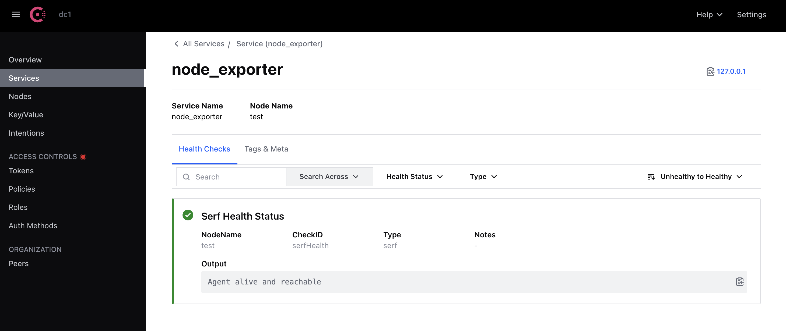

##### 与Prometheus集成

在consul_sd_configs定义当中通过server定义了Consul服务的访问地址，services则定义了当前需要发现哪些类型服务实例的信息，这里限定了只获取node_exporter的服务实例信息。

```yaml
scrape_configs:
  - job_name: node_exporter
    metrics_path: /metrics
    scheme: http
    consul_sd_configs:
      - server: localhost:8500
        services:
          - node_exporter
```

登陆target查看状态正常

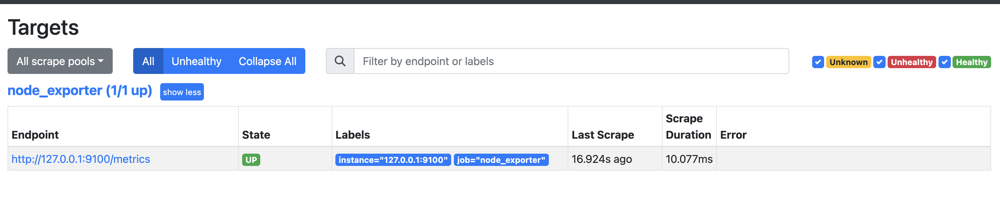

##### 服务发现与Relabeling

在Prometheus所有的Target实例中，都包含一些默认的Metadata标签信息。

默认情况下，当Prometheus加载Target实例完成后，这些Target时候都会包含一些默认的标签：

- `__address__`：当前Target实例的访问地址`<host>:<port>`
- `__scheme__`：采集目标服务访问地址的HTTP Scheme，HTTP或者HTTPS
- `__metrics_path__`：采集目标服务访问地址的访问路径
- `__param_<name>`：采集任务目标服务的中包含的请求参数

上面这些标签将会告诉Prometheus如何从该Target实例中获取监控数据。除了这些默认的标签以外，我们还可以为Target添加自定义的标签

一般来说，Target以`__`作为前置的标签是在系统内部使用的，因此这些标签不会被写入到样本数据中

Prometheus允许用户在采集任务设置中通过relabel_configs来添加自定义的Relabeling过程

Relabeling最基本的应用场景就是基于Target实例中包含的metadata标签，动态的添加或者覆盖标签。例如，通过Consul动态发现的服务实例还会包含以下Metadata标签信息：

- __meta_consul_address：consul地址
- __meta_consul_dc：consul中服务所在的数据中心
- __meta_consulmetadata：服务的metadata
- __meta_consul_node：服务所在consul节点的信息
- __meta_consul_service_address：服务访问地址
- __meta_consul_service_id：服务ID
- __meta_consul_service_port：服务端口
- __meta_consul_service：服务名称
- __meta_consul_tags：服务包含的标签信息

**重写前默认采集结果**

```shell
node_cpu{cpu="cpu0",instance="localhost:9100",job="node",mode="idle"} 
```

**重写后采集结果**

```shell
node_cpu_seconds_total{cnode="test", cpu="0", dc="dc1", instance="127.0.0.1:9100", job="node_exporter", mode="idle"}
```

可以发现重写后新增两个标签cnode，dc。两个标签来源为

```shell
__meta_consul_dc
__meta_consul_node
```

可以通过在每一个采集任务的配置中可以添加多个relabel_config配置，一个最简单的relabel配置如下

```yaml
scrape_configs:
  - job_name: node_exporter
    metrics_path: /metrics
    scheme: http
    consul_sd_configs:
      - server: 192.168.0.40:8500
        services:
          - node_exporter
    relabel_configs:
    - source_labels:  ["__meta_consul_dc"]
      target_label: "dc"
    - source_labels:  ["__meta_consul_node"]
      target_label: "cnode"
```


## Prometheus与kubernetes部署记录

### 认识kubernetes

Kubernetes将一系列的主机看做是一个受管理的海量资源，这些海量资源组成了一个能够方便进行扩展的操作系统。而在Kubernetes中运行着的容器则可以视为是这个操作系统中运行的“进程”，通过Kubernetes这一中央协调器，解决了基于容器应用程序的调度、伸缩、访问负载均衡以及整个系统的管理和监控的问题。

#### kubernetes应用管理模型


**Pod是Kubernetes中的最小调度资源。**Pod中会包含一组容器，它们一起工作，并且对外提供一个（或者一组）功能。对于这组容器而言它们共享相同的网络和存储资源，因此它们之间可以直接通过本地网络（127.0.0.1）进行访问。当Pod被创建时，调度器（kube-schedule）会从集群中找到满足条件的节点运行它。

**启动多个实例（副本），则需要使用到控制器（Controller）**，用户可以在Controller定义Pod的调度规则、运行的副本数量以及升级策略等等信息，当某些Pod发生故障之后，Controller会尝试自动修复，直到Pod的运行状态满足Controller中定义的预期状态为止。

Kubernetes中提供了多种Controller的实现，包括：

- Deployment（无状态应用）
- StatefulSet（有状态应用）
- Daemonset（守护模式）

**集群内的应用如何通信**，Service在Kubernetes集群内扮演了服务发现和负载均衡的作用。在Kubernetes下部署的Pod实例都会包含一组描述自身信息的label，而创建Service，可以声明一个Selector（标签选择器）。Service通过Selector，找到匹配标签规则的Pod实例，并将对Service的请求转发到代理的Pod中。Service创建完成后，集群内的应用就**可以通过使用Service的名称作为DNS域名进行相互访问。**

**外部用户如何访问部署在集群内的应用，**Kubernetes中定义了单独的资源Ingress（入口）。Ingress是一个工作在7层的负载均衡器，其负责代理外部进入集群内的请求，并将流量转发到对应的服务中。

**Kubernetes定义了Namespace（命名空间）对资源进行隔离。**同一个Kubernetes集群其可能被多个组织使用，为了隔离这些不同组织创建的应用程序。

#### kuberenetes架构模型


**Master组件**

Matser组件提供了集群层面的管理功能，它们负责响应用户请求并且对集群资源进行统一的调度和管理。

- kube-apiserver：负责对外暴露Kubernetes API；
- etcd：用于存储Kubernetes集群的所有数据；
- kube-scheduler: 负责为新创建的Pod选择可供其运行的节点；
- kube-controller-manager： 包含Node Controller，Deployment Controller，Endpoint Controller等等，通过与apiserver交互使相应的资源达到预期状态。

**Node组件**

Node组件会运行在集群的所有节点上，它们负责管理和维护节点中运行的Pod，为Kubernetes集群提供运行时环境。

- kubelet：负责维护和管理节点上Pod的运行状态；
- kube-proxy：负责维护主机上的网络规则以及转发。
- Container Runtime：如Docker,rkt,runc等提供容器运行时环境。

#### kubenetes监控策略

需要综合使用白盒监控和黑盒监控模式，建立从基础设施，Kubernetes核心组件，应用容器等全面的监控体系。

在白盒监控层面我们需要关注：

- 基础设施层（Node）：为整个集群和应用提供运行时资源，需要通过各节点的kubelet获取节点的基本状态，同时通过在节点上部署Node Exporter获取节点的资源使用情况；
- 容器基础设施（Container）：为应用提供运行时环境，Kubelet内置了对cAdvisor的支持，用户可以直接通过Kubelet组件获取给节点上容器相关监控指标；
- 用户应用（Pod）：Pod中会包含一组容器，它们一起工作，并且对外提供一个（或者一组）功能。如果用户部署的应用程序内置了对Prometheus的支持，那么我们还应该采集这些Pod暴露的监控指标；
- Kubernetes组件：获取并监控Kubernetes核心组件的运行状态，确保平台自身的稳定运行。

而在黑盒监控层面，则主要需要关注以下：

- 内部服务负载均衡（Service）：在集群内，通过Service在集群暴露应用功能，集群内应用和应用之间访问时提供内部的负载均衡。通过Blackbox Exporter探测Service的可用性，确保当Service不可用时能够快速得到告警通知；
- 外部访问入口（Ingress）：通过Ingress提供集群外的访问入口，从而可以使外部客户端能够访问到部署在Kubernetes集群内的服务。因此也需要通过Blackbox Exporter对Ingress的可用性进行探测，确保外部用户能够正常访问集群内的功能；

### 搭建本地kubenetes测试集群

#### 二进制部署详见kubernetes部署篇

#### 搭建方式(minikube)

通过工具Minikube(https://github.com/kubernetes/minikube)搭建一个本地的Kubernetes测试环境

##### 创建集群用户

```shell
useradd -m docker
passwd docker
#加入用户组
gpasswd -a docer docker	
#添加sudo权限
vim /etc/sudoers
#在root ALL=(ALL)ALL下增加
docker ALL=(ALL)ALL
```

##### 启动minikube

前置条件需要安装docker，并使用非root启动

```shell
mv minikube-xxx-xxx /user/local/bin/minikube
chmod +x minikube
minikube start
```

##### 安装kubectl

```shell
#配置 K8S 仓库
cat > /etc/yum.repos.d/kubernetes.repo << EOF
[kubernetes]
name=Kubernetes
baseurl=https://mirrors.aliyun.com/kubernetes/yum/repos/kubernetes-el7-x86_64/
enabled=1
gpgcheck=1
repo_gpgcheck=1
gpgkey=https://mirrors.aliyun.com/kubernetes/yum/doc/yum-key.gpg https://mirrors.aliyun.com/kubernetes/yum/doc/rpm-package-key.gpg
EOF
#安装kubectl
yum install kubectl -y
```

##### 验证node状态

```shell
kubectl get pods -A
kubectl get nodes -o wide
```

#### 部署nginx应用测试

Kubernetes中管理的所有资源都可以通过YAML文件进行描述

##### 创建deployment应用配置

```yaml
apiVersion: apps/v1
kind: Deployment
metadata:
  name: nginx-deployment
  labels:
    app: nginx
spec:
  replicas: 3
  selector:
    matchLabels:
      app: nginx
  template:
    metadata:
      labels:
        app: nginx
    spec:
      containers:
      - name: nginx
        image: nginx:1.7.9
        ports:
        - containerPort: 80
```

在该YAML文件中，我们定义了需要创建的资源类型为Deployment，在metadata中声明了该Deployment的名称以及标签。spec中则定义了该Deployment的具体设置，通过replicas定义了该Deployment创建后将会自动创建3个Pod实例。运行的Pod以及进行则通过template进行定义

##### 执行创建应用

```shell
kubectl create -f nginx-deployment.yml
```

##### 查看应用状态

```shell
[docker@VM-0-12-centos minikube]$ kubectl get deployments
NAME               READY   UP-TO-DATE   AVAILABLE   AGE
nginx-deployment   3/3     3            3           34m
[docker@VM-0-12-centos minikube]$ 
[docker@VM-0-12-centos minikube]$ 
[docker@VM-0-12-centos minikube]$ 
[docker@VM-0-12-centos minikube]$ kubectl get pods
NAME                               READY   STATUS    RESTARTS   AGE
nginx-deployment-9d6cbcc65-75ljd   1/1     Running   0          34m
nginx-deployment-9d6cbcc65-qw2mm   1/1     Running   0          34m
nginx-deployment-9d6cbcc65-vcn2p   1/1     Running   0          34m
```

##### 创建service配置文件

```yaml
kind: Service
apiVersion: v1
metadata:
  name: nginx-service
spec:
  selector:
    app: nginx
  ports:
  - protocol: TCP
    port: 80
    targetPort: 80
  #默认情况下，Service资源只能通过集群网络进行访问(type=ClusterIP)。这里为了能够直接访问该Service，需要将容器端口映射到主机上，因此定义该Service类型为NodePort。
  type: NodePort
```

##### 执行创建svc

```shell
kubectl create -f nginx-svc.yml
```

```SHELL
[docker@VM-0-12-centos minikube]$ kubectl get svc
NAME            TYPE        CLUSTER-IP      EXTERNAL-IP   PORT(S)        AGE
kubernetes      ClusterIP   10.96.0.1       <none>        443/TCP        66m
nginx-service   NodePort    10.110.126.59   <none>        80:31077/TCP   34m
##如上端口映射到31077
```

通过访问集群ip:port可以访问

```shell
[docker@VM-0-12-centos minikube]$ curl -v 192.168.49.2:31077
* About to connect() to 192.168.49.2 port 31077 (#0)
*   Trying 192.168.49.2...
* Connected to 192.168.49.2 (192.168.49.2) port 31077 (#0)
> GET / HTTP/1.1
> User-Agent: curl/7.29.0
> Host: 192.168.49.2:31077
> Accept: */*
> 
< HTTP/1.1 200 OK
```

##### 实例动态扩展

```shell
[docker@VM-0-12-centos minikube]$ kubectl scale deployments/nginx-deployment --replicas=4
deployment.apps/nginx-deployment scaled
```

##### 镜像滚动升级

```shell
kubectl set image deployment/nginx-deployment nginx=nginx:1.9.1
deployment.apps/nginx-deployment image updated
```

##### 查看扩展和升级后的状态

```shell
[docker@VM-0-12-centos minikube]$ kubectl get pods
NAME                                READY   STATUS    RESTARTS   AGE
nginx-deployment-7ffd5c8dc9-b5xp9   1/1     Running   0          31s
nginx-deployment-7ffd5c8dc9-gf5wt   1/1     Running   0          46s
nginx-deployment-7ffd5c8dc9-jjg24   1/1     Running   0          46s
nginx-deployment-7ffd5c8dc9-sw4jc   1/1     Running   0          30s
```

##### 升级失败后回滚

```shell
kubectl rollout undo deployment/nginx-deployment
```

### k8s部署prometheus

#### 使用ConfigMaps

当使用Deployment管理和部署应用程序时，用户可以方便了对应用进行扩容或者缩容，从而产生多个Pod实例。为了能够统一管理这些Pod的配置信息，在Kubernetes中可以使用ConfigMaps资源定义和管理这些配置，并且通过环境变量或者文件系统挂载的方式让容器使用这些配置。

##### 创建prometheus ConfigMap

```shell
cat > prometheus-configmap.yaml << EOF
apiVersion: v1
kind: ConfigMap
metadata:
  name: prometheus-config
data:
  prometheus.yml: |
    global:
      scrape_interval:     15s 
      evaluation_interval: 15s
    scrape_configs:
      - job_name: 'prometheus'
        static_configs:
        - targets: ['localhost:9090']
EOF
```

##### 创建ConfigMap资源

```shell
[docker@VM-0-12-centos minikube]$ kubectl create -f prometheus-config.yml
configmap/prometheus-config created
```

##### 验证ConfigMap是否创建成功

```shell
[docker@VM-0-12-centos minikube]$ kubectl get configmap
NAME                DATA   AGE
kube-root-ca.crt    1      93m
prometheus-config   1      5m58s
[docker@VM-0-12-centos minikube]$ kubectl describe configmap prometheus-config
Name:         prometheus-config
Namespace:    default
Labels:       <none>
Annotations:  <none>

Data
====
prometheus.yml:
----
global:
  scrape_interval:     15s 
  evaluation_interval: 15s
scrape_configs:
  - job_name: 'prometheus'
    static_configs:
    - targets: ['localhost:9090']    


BinaryData
====

Events:  <none>
```

当ConfigMap资源创建成功后，我们就可以通过Volume挂载的方式，将Prometheus的配置文件挂载到容器中

#### 通过Deloyment部署prometheus

##### 创建yml配置

编辑配置文件，文件中一并定义了service和deployment的配置

Service类型为NodePort，这样我们可以通过虚拟机IP和端口访问到Prometheus实例

为了能够让Prometheus实例使用ConfigMap中管理的配置文件，这里通过**volumes声明了一个磁盘卷**。并且通过**volumeMounts将该磁盘卷挂载到了Prometheus实例的/etc/prometheus目录下。**

```shell
cat > prometheus-deployment.yml << EOF
apiVersion: v1
kind: "Service"
metadata:
  name: prometheus
  labels:
    name: prometheus
spec:
  ports:
  - name: prometheus
    protocol: TCP
    port: 9090
    targetPort: 9090
  selector:
    app: prometheus
  type: NodePort
---
apiVersion: apps/v1
kind: Deployment
metadata:
  labels:
    app: prometheus
  name: prometheus
spec:
  replicas: 1
  selector:
    matchLabels:
      app: prometheus
  template:
    metadata:
      labels:
        app: prometheus
    spec:
      containers:
      - name: prometheus
        image: prom/prometheus:v2.2.1
        command:
        - "/bin/prometheus"
        args:
        - "--config.file=/etc/prometheus/prometheus.yml"
        ports:
        - containerPort: 9090
          protocol: TCP
        volumeMounts:
        - mountPath: "/etc/prometheus"
          name: prometheus-config
      volumes:
      - name: prometheus-config
        configMap:
          name: prometheus-config
EOF
```

##### 创建prometheus-deloyment

```shell
[docker@VM-0-12-centos minikube]$ kubectl create -f prometheus-deployment.yml 
service/prometheus created
deployment.apps/prometheus created
[docker@VM-0-12-centos minikube]$ kubectl get pod
NAME                                READY   STATUS    RESTARTS   AGE
nginx-deployment-7ffd5c8dc9-gf5wt   1/1     Running   0          47m
prometheus-5bcf6c98db-s45lw         1/1     Running   0          97s
[docker@VM-0-12-centos minikube]$ kubectl get nodes -o wide
NAME       STATUS   ROLES           AGE    VERSION   INTERNAL-IP    EXTERNAL-IP   OS-IMAGE             KERNEL-VERSION                CONTAINER-RUNTIME
minikube   Ready    control-plane   122m   v1.28.3   192.168.49.2   <none>        Ubuntu 22.04.3 LTS   3.10.0-1160.99.1.el7.x86_64   docker://24.0.7
```

##### 使用 kubectl port-forward 暴露pod端口到外网(仅限测试)

```shell
kubectl port-forward prometheus-5bcf6c98db-s45lw 9090:9090 --address 0.0.0.0
```

###### 服务验证

```shell
[docker@VM-0-12-centos minikube]$ curl -v 192.168.49.2:31143/graph
* About to connect() to 192.168.49.2 port 31143 (#0)
*   Trying 192.168.49.2...
* Connected to 192.168.49.2 (192.168.49.2) port 31143 (#0)
> GET /graph HTTP/1.1
> User-Agent: curl/7.29.0
> Host: 192.168.49.2:31143
> Accept: */*
> 
< HTTP/1.1 200 OK
< Date: Wed, 29 Nov 2023 09:58:06 GMT
< Content-Type: text/html; charset=utf-8
< Transfer-Encoding: chunked
```

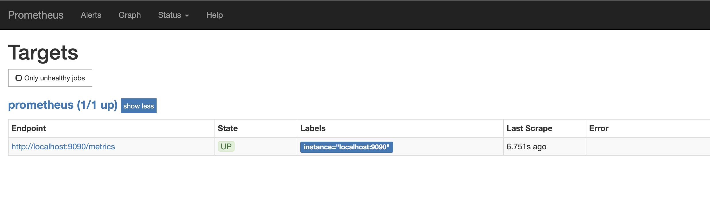

### kubernetes下服务发现

Prometheus的服务发现能力，它能够与通过与“中间代理人“的交互，从而动态的获取需要监控的目标实例。而在Kubernetes下Prometheus就是需要**与Kubernetes的API进行交互**，从而能够动态的发现Kubernetes中部署的所有可监控的目标资源。

#### kuebernetes访问授权

为了让prometheus能够访问受K8S保护的API，需要对prometheus进行访问授权

在Kubernetes中主要使用基于角色的**访问控制模型(Role-Based Access Control)**

***定义角色（ClusterRole）---> 为角色赋权 ---> 创建prometheus使用的账号（ServiceAccount）---> 角色与账号绑定（ClusterRoleBinding）***

上述操作在kubernetes中可以被视为一系列资源

可以通过yaml创建

##### 创建prometheus访问授权文件

**ClusterRole是全局的，不需要指定命名空间。**

**ServiceAccount是属于特定命名空间的资源。**

###### ClusterRole

```yaml
# 这是一个 Kubernetes RBAC（Role-Based Access Control）的 ClusterRole 配置文件，用于定义对集群中资源的访问规则。
apiVersion: rbac.authorization.k8s.io/v1
kind: ClusterRole
metadata:
  name: prometheus
# 元数据信息，其中 `name` 字段指定了这个 ClusterRole 的名称为 `prometheus`。
rules:
# 规则部分开始
- apiGroups: [""]
  resources:
  - nodes
  - nodes/proxy
  - services
  - endpoints
  - pods
  verbs: ["get", "list", "watch"]
# 这个规则指定了对一组 API 资源的操作权限。
# `apiGroups: [""]` 表示这个规则适用于不属于任何 API 组的核心 Kubernetes 资源。
# `resources` 列表包含了可以操作的资源类型，比如 `nodes`、`services`、`endpoints` 等。
# `verbs` 列表包含了允许执行的动作，这里是 "get"、"list" 和 "watch"。

- apiGroups:
  - extensions
  resources:
  - ingresses
  verbs: ["get", "list", "watch"]
# 这个规则定义了对 Ingress 资源的权限。
# `apiGroups: ["extensions"]` 表示这个规则适用于 `extensions` API 组。
# `resources: ["ingresses"]` 表示这个规则适用于 Ingress 资源。
# `verbs: ["get", "list", "watch"]` 表示允许执行 "get"、"list" 和 "watch" 操作。

- nonResourceURLs: ["/metrics"]
  verbs: ["get"]

# 这个规则定义了对非资源型的 URL `/metrics` 的权限。
# `nonResourceURLs: ["/metrics"]` 表示这个规则适用于指定的非资源型 URL。
# `verbs: ["get"]` 表示允许执行 "get" 操作。
# 规则部分结束
# 这个 ClusterRole 的目的是为 Prometheus 提供在 Kubernetes 中收集指标所需的权限。

```

###### ServiceAccount

```yaml
# 这是一个 Kubernetes ServiceAccount 配置文件，用于定义一个服务账户。
apiVersion: v1
kind: ServiceAccount
metadata:
  name: prometheus
  namespace: default
# 元数据信息，其中 `name` 字段指定了这个 ServiceAccount 的名称为 `prometheus`，
# `namespace` 字段指定了这个 ServiceAccount 所属的命名空间为 `default`。
```

###### ClusterRoleBinding

```yaml
# 这是一个 Kubernetes ClusterRoleBinding 配置文件，用于将 ClusterRole 绑定到一个 ServiceAccount 上。
apiVersion: rbac.authorization.k8s.io/v1
kind: ClusterRoleBinding
metadata:
  name: prometheus
# 元数据信息，其中 `name` 字段指定了这个 ClusterRoleBinding 的名称为 `prometheus`。
roleRef:
# 指定角色引用的信息
  apiGroup: rbac.authorization.k8s.io
  kind: ClusterRole
  name: prometheus
# `apiGroup` 和 `kind` 指定了要引用的角色的 API 组和类型，`name` 指定了角色的名称为 `prometheus`。
subjects:
# 定义了角色绑定的主体，即拥有这个角色的身份。
- kind: ServiceAccount
  name: prometheus
  namespace: default
# `kind` 指定主体的类型为 ServiceAccount，`name` 指定了 ServiceAccount 的名称为 `prometheus`，
# `namespace` 指定了 ServiceAccount 所属的命名空间为 `default`。
```

###### 完整配置如下

```shell
cat > prometheus-rbac-setup.yml << EOF
apiVersion: rbac.authorization.k8s.io/v1
kind: ClusterRole
metadata:
  name: prometheus
rules:
- apiGroups: [""]
  resources:
  - nodes
  - nodes/proxy
  - services
  - endpoints
  - pods
  verbs: ["get", "list", "watch"]
- apiGroups:
  - extensions
  resources:
  - ingresses
  verbs: ["get", "list", "watch"]
- nonResourceURLs: ["/metrics"]
  verbs: ["get"]
---
apiVersion: v1
kind: ServiceAccount
metadata:
  name: prometheus
  namespace: default
---
apiVersion: rbac.authorization.k8s.io/v1
kind: ClusterRoleBinding
metadata:
  name: prometheus
roleRef:
  apiGroup: rbac.authorization.k8s.io
  kind: ClusterRole
  name: prometheus
subjects:
- kind: ServiceAccount
  name: prometheus
  namespace: default
EOF
```

##### 创建RBAC对应的资源

```shell
kubectl create -f prometheus-rbac-setup.yml
```

##### 验证角色与账号绑定（ClusterRoleBinding）

```shell
[docker@VM-0-12-centos minikube]$ kubectl describe clusterrolebinding prometheus
Name:         prometheus
Labels:       <none>
Annotations:  <none>
Role:
  Kind:  ClusterRole
  Name:  prometheus
Subjects:
  Kind            Name        Namespace
  ----            ----        ---------
  ServiceAccount  prometheus  default
```

##### 验证角色（ClusterRole）与服务账号（ServiceAccount）

```shell
[docker@VM-0-12-centos minikube]$ kubectl describe clusterrole prometheus
Name:         prometheus
Labels:       <none>
Annotations:  <none>
PolicyRule:
  Resources             Non-Resource URLs  Resource Names  Verbs
  ---------             -----------------  --------------  -----
  endpoints             []                 []              [get list watch]
  nodes/proxy           []                 []              [get list watch]
  nodes                 []                 []              [get list watch]
  pods                  []                 []              [get list watch]
  services              []                 []              [get list watch]
  ingresses.extensions  []                 []              [get list watch]
                        [/metrics]         []              [get]
[docker@VM-0-12-centos minikube]$ kubectl describe serviceaccounts prometheus
Name:                prometheus
Namespace:           default
Labels:              <none>
Annotations:         <none>
Image pull secrets:  <none>
Mountable secrets:   <none>
Tokens:              <none>
Events:              <none>

```

##### 指定prometheus使用特定的serviceaccount创建pod

```yaml
#编辑prometheus-deployment.yml
sudo vim prometheus-deployment.yml
#添加serviceAccountName和serviceAccount定义
spec:
  replicas: 1
  template:
    metadata:
      labels:
        app: prometheus
    spec:
      serviceAccountName: prometheus
      serviceAccount: prometheus
```

执行kubectl apply

```shell
kubectl apply -f prometheus-deployment.yml
```

##### 验证serviceaccount和CA证书

```shell
[docker@VM-0-12-centos minikube]$ kubectl describe pod prometheus-85d76fb498-6w479 
Name:             prometheus-85d76fb498-6w479
Namespace:        default
Priority:         0
Service Account:  prometheus
Node:             minikube/192.168.49.2
Start Time:       Thu, 30 Nov 2023 16:10:04 +0800
Labels:           app=prometheus
                  pod-template-hash=85d76fb498
Annotations:      <none>
Status:           Running
IP:               10.244.0.15
.....
```

查看CA

```shell
kubectl exec -it prometheus-85d76fb498-6w479 ls /var/run/secrets/kubernetes.io/serviceaccount/
```

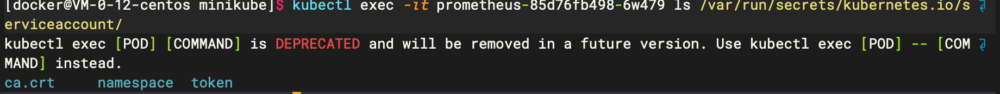

##### 相关命令扩展

```shell
# 查看 ClusterRoles 和 ClusterRoleBindings
kubectl get clusterroles
kubectl get clusterrolebindings

# 查看 Roles 和 RoleBindings（在命名空间内）
kubectl get roles --all-namespaces
kubectl get rolebindings --all-namespaces

# 查看 ServiceAccounts
kubectl get serviceaccounts --all-namespaces

# 查看特定 ClusterRole 或 ClusterRoleBinding 的详细信息
kubectl describe clusterrole <clusterrole-name>
kubectl describe clusterrolebinding <clusterrolebinding-name>

# 查看特定 Role 或 RoleBinding 的详细信息（在命名空间内）
kubectl describe role <role-name> --namespace=<namespace>
kubectl describe rolebinding <rolebinding-name> --namespace=<namespace>

# 查看特定 ServiceAccount 的详细信息（在命名空间内）
kubectl describe serviceaccount <serviceaccount-name> --namespace=<namespace>
```

#### 服务发现

在Kubernetes下，Promethues通过与Kubernetes API集成目前主要支持5种服务发现模式，分别是：Node、Service、Pod、Endpoints、Ingress。

##### 配置文件添加

kubectl访问

```shell 
kubectl get nodes -o wide
```

为了能够让Prometheus能够获取到当前集群中所有节点的信息，在Prometheus的配置文件中，我们添加如下Job配置

```yaml
- job_name: 'kubernetes-nodes'
  tls_config:
    ca_file: /var/run/secrets/kubernetes.io/serviceaccount/ca.crt
  bearer_token_file: /var/run/secrets/kubernetes.io/serviceaccount/token
  kubernetes_sd_configs:
  - role: node
```

通过指定kubernetes_sd_config的模式为node，Prometheus会自动从Kubernetes中发现到所有的node节点并作为当前Job监控的Target实例。如下所示，这里需要指定用于访问Kubernetes API的ca以及token文件路径

**对于Ingress，Service，Endpoints, Pod的使用方式也是类似的**

```yaml
apiVersion: v1
data:
  prometheus.yml: |-
    global:
      scrape_interval:     15s 
      evaluation_interval: 15s
    scrape_configs:

    - job_name: 'kubernetes-nodes'
      tls_config:
        ca_file: /var/run/secrets/kubernetes.io/serviceaccount/ca.crt
      bearer_token_file: /var/run/secrets/kubernetes.io/serviceaccount/token
      kubernetes_sd_configs:
      - role: node

    - job_name: 'kubernetes-service'
      tls_config:
        ca_file: /var/run/secrets/kubernetes.io/serviceaccount/ca.crt
      bearer_token_file: /var/run/secrets/kubernetes.io/serviceaccount/token
      kubernetes_sd_configs:
      - role: service    
   
    - job_name: 'kubernetes-endpoints'
      tls_config:
        ca_file: /var/run/secrets/kubernetes.io/serviceaccount/ca.crt
      bearer_token_file: /var/run/secrets/kubernetes.io/serviceaccount/token
      kubernetes_sd_configs:
      - role: endpoints

    - job_name: 'kubernetes-ingress'
      tls_config:
        ca_file: /var/run/secrets/kubernetes.io/serviceaccount/ca.crt
      bearer_token_file: /var/run/secrets/kubernetes.io/serviceaccount/token
      kubernetes_sd_configs:
      - role: ingress
 
    - job_name: 'kubernetes-pods'
      tls_config:
        ca_file: /var/run/secrets/kubernetes.io/serviceaccount/ca.crt
      bearer_token_file: /var/run/secrets/kubernetes.io/serviceaccount/token
      kubernetes_sd_configs:
      - role: pod
kind: ConfigMap
metadata:
  name: prometheus-config
```

##### 更新配置文件并重建pod

```shell
kubectl apply -f prometheus-config.yml
kubectl get pods | grep prome | awk {'print$1'} | xargs kubectl delete
watch kubectl get pods
```

等待重新running

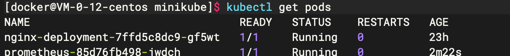

##### 重建接口映射（仅测试）

```shell
nohup kubectl port-forward prometheus-85d76fb498-jwdch 9090:9090 --address 0.0.0.0 &
```

##### 访问promethues UI，查看Service Discovery

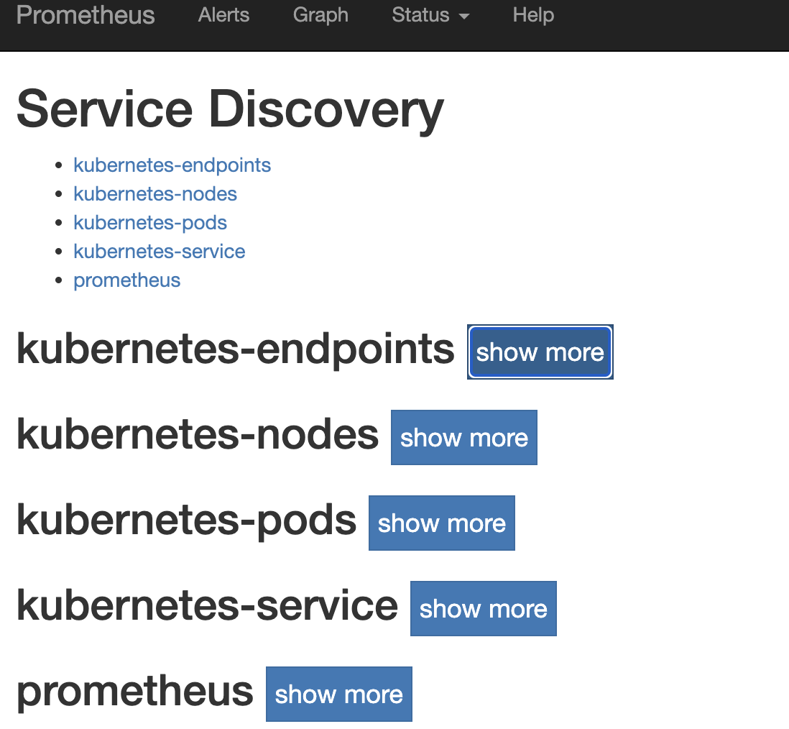


### 使用prometheus完整监控K8S

#### 添加重建prometheus脚本

为了方便重启prometheus，编写配置重建脚本

```shell
vim rebuild.sh
#!/bin/bash
CFGPATH="/data/prometheus/cfg"
echo "apply and rebulid"
sleep 1
kubectl apply -f ${CFGPATH}/prometheus-configmap.yaml
kubectl get pods | grep prome | awk {'print$1'} | xargs kubectl delete pods
while true; do
    status=$(kubectl get pods | grep prome | awk '{print $3}')
    if [ "${status}" == "Running" ]; then
        echo "Pod status Running"
        kubectl get pods
        break  # 退出循环，因为状态为 Running
    elif
    	 [ "${status}" == "CrashLoopBackOff" ]; then
    	 echo "Pod status is ERROR"
       kubectl get pods | grep prom | awk {'print$1'} | xargs kubectl logs | grep 'error'
       break
    else
        echo "Pod status is not Running. Waiting..."
        sleep 5  # 等待5秒，可以根据需要调整等待时间
    fi
done
```


上文服务发现配置成功，查看targets发现大多数监控不可用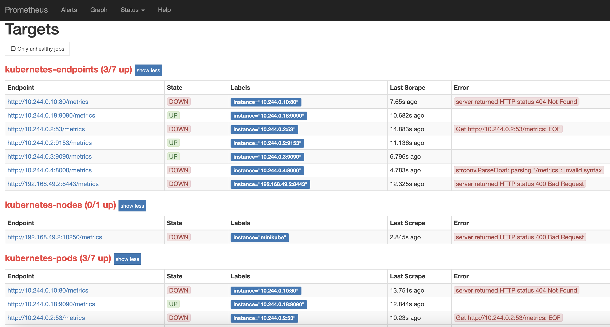

本节将完善集群监控

下表中，梳理了监控Kubernetes集群监控的各个维度以及策略：

| 目标                                                         | 服务发现模式 | 监控方法 | 数据源            |
| :----------------------------------------------------------- | :----------- | :------- | :---------------- |
| 从集群各节点kubelet组件中获取节点kubelet的基本运行状态的监控指标 | node         | 白盒监控 | kubelet           |
| 从集群各节点kubelet内置的cAdvisor中获取，节点中运行的容器的监控指标 | node         | 白盒监控 | kubelet           |
| 从部署到各个节点的Node Exporter中采集主机资源相关的运行资源  | node         | 白盒监控 | node exporter     |
| 对于内置了Prometheus支持的应用，需要从Pod实例中采集其自定义监控指标 | pod          | 白盒监控 | custom pod        |
| 获取API Server组件的访问地址，并从中获取Kubernetes集群相关的运行监控指标 | endpoints    | 白盒监控 | api server        |
| 获取集群中Service的访问地址，并通过Blackbox Exporter获取网络探测指标 | service      | 黑盒监控 | blackbox exporter |
| 获取集群中Ingress的访问信息，并通过Blackbox Exporter获取网络探测指标 | ingress      | 黑盒监控 | blackbox exporter |

#### 从kubelet中获取Node运行状态

Kubelet组件运行在Kubernetes集群的各个节点中，其负责维护和管理节点上Pod的运行状态。kubelet组件的正常运行直接关系到该节点是否能够正常的被Kubernetes集群正常使用。

基于Node模式，Prometheus会自动发现Kubernetes中所有Node节点的信息并作为监控的目标Target。 而这些Target的访问地址实际上就是Kubelet的访问地址，并且Kubelet实际上直接内置了对Prometheus的支持。

##### 配置文件（跳过CA校验）

```yaml
cat > prometheus-configmap.yaml << EOF
apiVersion: v1
kind: ConfigMap
metadata:
  name: prometheus-config
data:
  prometheus.yml: |-
    global:
      scrape_interval:     15s
      evaluation_interval: 15s
    scrape_configs:
    - job_name: 'prometheus'
      static_configs:
      - targets: ['localhost:9090']
    - job_name: 'kubernetes-kubelet'
      scheme: https
      tls_config:
        ca_file: /var/run/secrets/kubernetes.io/serviceaccount/ca.crt
        insecure_skip_verify: true
      bearer_token_file: /var/run/secrets/kubernetes.io/serviceaccount/token
      kubernetes_sd_configs:
      - role: node
      relabel_configs:
      - action: labelmap
        regex: __meta_kubernetes_node_label_(.+)
EOF
```

这里使用Node模式自动发现集群中所有Kubelet作为监控的数据采集目标，同时通过labelmap步骤，将Node节点上的标签，作为样本的标签保存到时间序列当中。

由于当前使用的ca证书中，并不包含集群的地址信息

***需要通过在tls_config中设置 insecure_skip_verify为true即可跳过校验ca***

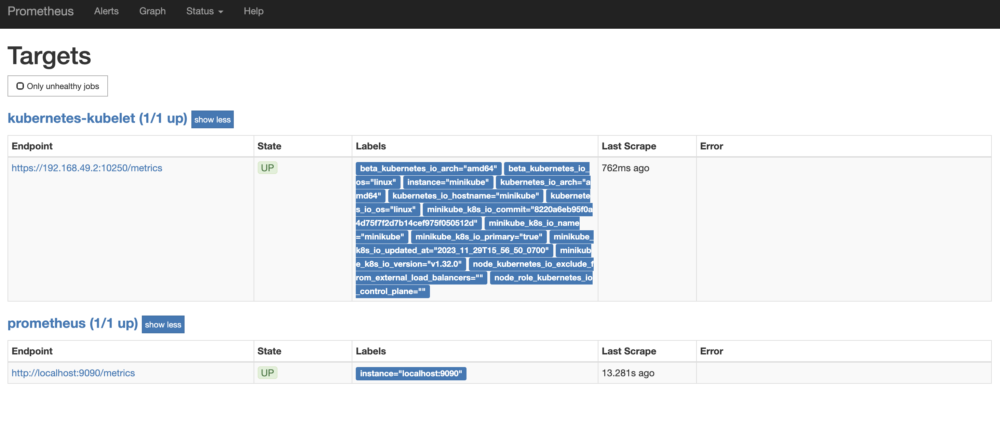

##### 配置文件（通过Kubernetes的api-server提供的代理API）

***通过Kubernetes的api-server提供的代理API访问各个节点中kubelet的metrics服务***

```yaml
apiVersion: v1
kind: ConfigMap
metadata:
  name: prometheus-config
data:
  prometheus.yml: |-
    global:
      scrape_interval:     15s
      evaluation_interval: 15s
    scrape_configs:
    - job_name: 'prometheus'
      static_configs:
      - targets: ['localhost:9090']
    - job_name: 'kubernetes-kubelet'
      scheme: https
      tls_config:
        ca_file: /var/run/secrets/kubernetes.io/serviceaccount/ca.crt
        #insecure_skip_verify: true
      bearer_token_file: /var/run/secrets/kubernetes.io/serviceaccount/token
      kubernetes_sd_configs:
      - role: node
      relabel_configs:
      - action: labelmap
        regex: __meta_kubernetes_node_label_(.+)
      - target_label: __address__
        replacement: kubernetes.default.svc:443
      - source_labels: [__meta_kubernetes_node_name]
        regex: (.+)
        target_label: __metrics_path__
        replacement: /api/v1/nodes/${1}/proxy/metrics
```

通过relabeling，将从Kubernetes获取到的默认地址`__address__`替换为kubernetes.default.svc:443。同时将`__metrics_path__`替换为api-server的代理地址/api/v1/nodes/${1}/proxy/metrics。

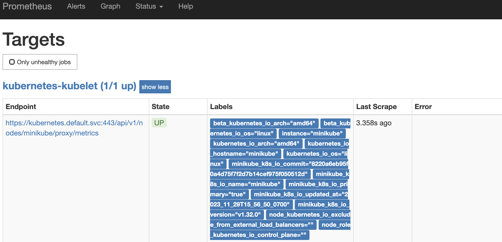

#### kubelet获取节点容器资源使用情况

kubelet除了自身监控指标信息以外，kubelet组件内置cadvisor。

cAdvisor能够获取当前节点上运行的所有容器的资源使用情况，通过访问kubelet的/metrics/cadvisor地址可以获取到cadvisor的监控指标

##### 配置文件（跳过CA校验）

直接访问metrics地址

```yaml
- job_name: 'kubernetes-cadvisor'
  scheme: https
  tls_config:
    ca_file: /var/run/secrets/kubernetes.io/serviceaccount/ca.crt
    insecure_skip_verify: true
  bearer_token_file: /var/run/secrets/kubernetes.io/serviceaccount/token
  kubernetes_sd_configs:
  - role: node
  relabel_configs:
  - source_labels: [__meta_kubernetes_node_name]
    regex: (.+)
    target_label: __metrics_path__
    replacement: metrics/cadvisor
  - action: labelmap
    regex: __meta_kubernetes_node_label_(.+)
```

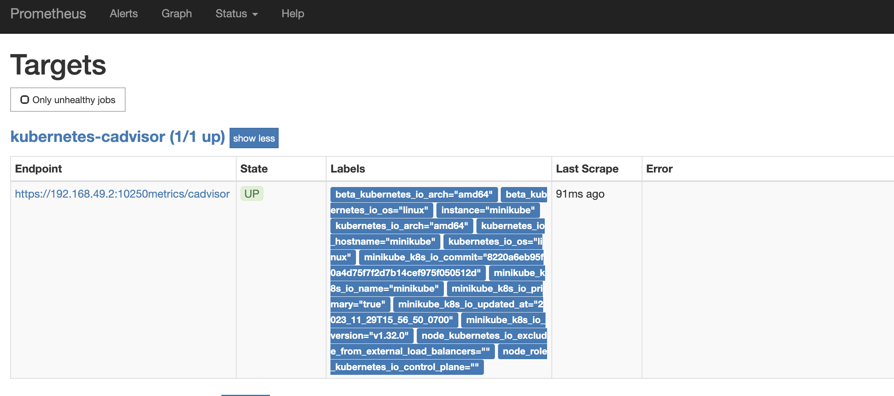

##### 配置文件（通过api-server）

通过api-server提供的代理地址访问kubelet的/metrics/cadvisor地址

```yaml
- job_name: 'kubernetes-cadvisor'
  scheme: https
  tls_config:
    ca_file: /var/run/secrets/kubernetes.io/serviceaccount/ca.crt
    insecure_skip_verify: true
  bearer_token_file: /var/run/secrets/kubernetes.io/serviceaccount/token
  kubernetes_sd_configs:
  - role: node
  relabel_configs:
  - target_label: __address__
    replacement: kubernetes.default.svc:443
  - source_labels: [__meta_kubernetes_node_name]
    regex: (.+)
    target_label: __metrics_path__
    replacement: /api/v1/nodes/${1}/proxy/metrics/cadvisor
  - action: labelmap
    regex: __meta_kubernetes_node_label_(.+)
```

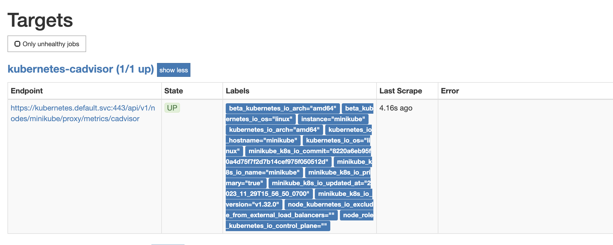

#### 使用NodeExporter监控集群资源使用情况

##### 部署Node_Exporter为Daemonset

监控采集集群中各个节点的资源使用情况，需要在各个节点中部署一个Node Exporter。

为保证每个节点只运行一个唯一实例，需要使用Daemonset控制器。

Daemonset的管理方式类似于操作系统中的守护进程。**Daemonset会确保在集群中所有（也可以指定）节点上运行一个唯一的Pod实例。**

```shell
vim node-exporter-daemonset.yml
```

```yaml
apiVersion: apps/v1
kind: DaemonSet
metadata:
  name: node-exporter
spec:
  selector:
    matchLabels:
      app: node-exporter
  template:
    metadata:
      annotations:
        prometheus.io/scrape: 'true'
        prometheus.io/port: '9100'
        prometheus.io/path: 'metrics'
      labels:
        app: node-exporter
      name: node-exporter
    spec:
      containers:
      - image: prom/node-exporter
        imagePullPolicy: IfNotPresent
        name: node-exporter
        ports:
        - containerPort: 9100
          hostPort: 9100
          name: scrape
      hostNetwork: true
      hostPID: true
```

```shell
kubectl create -f node-exporter-daemonset.yml
```

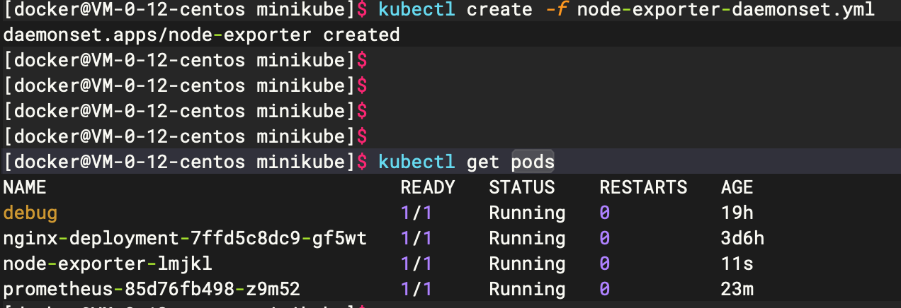

```shell
kubectl get daemonsets
```

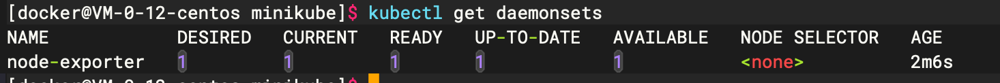

```shell
curl http://192.168.49.2:9100/metrics
```

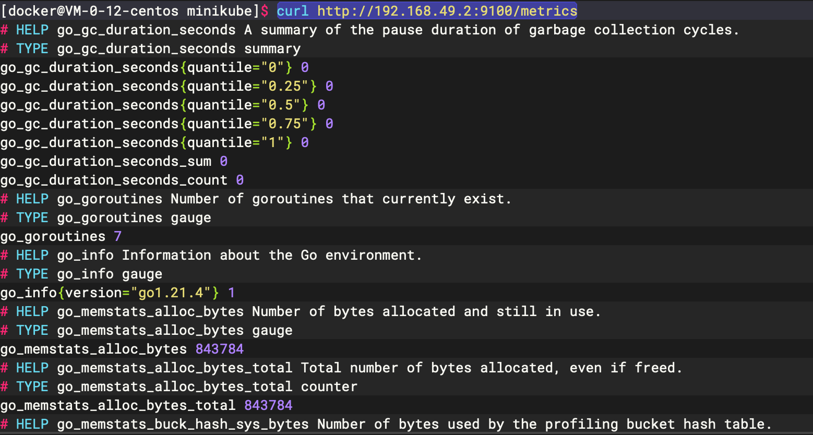

##### 配置prometheus与Node_Exporter并对当前node上pod支持

由于Kubernetes中并非所有的Pod都提供了对Prometheus的支持，有些可能只是一些简单的用户应用，为了区分哪些Pod实例是可以供Prometheus进行采集的，这里我们为Node Exporter添加了注解

由于Kubernetes中Pod可能会包含多个容器，还需要用户通过注解指定用户提供监控指标的采集端口

而有些情况下，Pod中的容器可能并没有使用默认的/metrics作为监控采集路径，因此还需要支持用户指定采集路径

```yaml
prometheus.io/scrape: 'true'
prometheus.io/port: '9100'
prometheus.io/path: 'metrics'
```

###### 添加prometheus配置文件

```yaml
- job_name: 'kubernetes-pods'
      kubernetes_sd_configs:
      - role: pod
      relabel_configs:
      - source_labels: [__meta_kubernetes_pod_annotation_prometheus_io_scrape]
        action: keep
        regex: true
      - source_labels: [__meta_kubernetes_pod_annotation_prometheus_io_path]
        action: replace
        target_label: __metrics_path__
        regex: (.+)
      - source_labels: [__address__, __meta_kubernetes_pod_annotation_prometheus_io_port]
        action: replace
        regex: ([^:]+)(?::\d+)?;(\d+)
        replacement: $1:$2
        target_label: __address__
      - action: labelmap
        regex: __meta_kubernetes_pod_label_(.+)
      - source_labels: [__meta_kubernetes_namespace]
        action: replace
        target_label: kubernetes_namespace
      - source_labels: [__meta_kubernetes_pod_name]
        action: replace
        target_label: kubernetes_pod_name
```

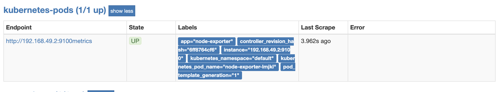

通过以上relabel过程实现对Pod实例的过滤，以及采集任务地址替换，从而实现对特定Pod实例监控指标的采集。需要说明的是kubernetes-pods并不是只针对Node Exporter而言，对于用户任意部署的Pod实例，只要其提供了对Prometheus的支持，用户都可以通过为Pod添加注解的形式为其添加监控指标采集的支持。

#### 从kube-apiserver获取集群运行监控指标

##### kubernertes service负载均衡


- 代理对集群内部应用Pod实例的请求：当创建Service时如果指定了标签选择器，Kubernetes会监听集群中所有的Pod变化情况，通过Endpoints自动维护满足标签选择器的Pod实例的访问信息；
- 代理对集群外部服务的请求：当创建Service时如果不指定任何的标签选择器，此时需要用户手动创建Service对应的Endpoint资源。例如，一般来说，为了确保数据的安全，我们通常讲数据库服务部署到集群外。 这是为了避免集群内的应用硬编码数据库的访问信息，这是就可以通过在集群内创建Service，并指向外部的数据库服务实例。

kube-apiserver为整个**kubernetes集群管理的入口**，负责对外暴露kubenetes API

kube-apiserver组件一般是独立部署在集群外

**为了方便集群内的应用能够与kube-apiserver交互，kubenetes会默认在命名空间创建一个名为kubernetes的服务**

```shell
kubectl get svc kubernetes -o wide
```

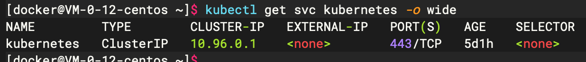

而该kubernetes服务代理的后端实际地址通过endpoints进行维护

```shell
kubectl get endpoints
```

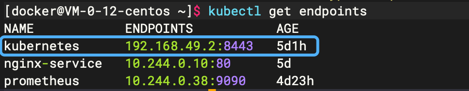

通过这种方式集群内的应用或者系统主机就可以通过集群内部的DNS域名kubernetes.default.svc访问到部署外部的kube-apiserver实例

因此，**如果我们想要监控kube-apiserver相关的指标，只需要通过endpoints资源找到kubernetes对应的所有后端地址**即可。

##### 创建监控任务

指定服务发现模式为endpoints。

Prometheus会查找当前集群中所有的endpoints配置，并通过relabel进行判断是否为apiserver对应的访问地址

```yaml
- job_name: 'kubernetes-apiservers'
  kubernetes_sd_configs:
  - role: endpoints
  scheme: https
  tls_config:
    ca_file: /var/run/secrets/kubernetes.io/serviceaccount/ca.crt
  bearer_token_file: /var/run/secrets/kubernetes.io/serviceaccount/token
  relabel_configs:
  - source_labels: [__meta_kubernetes_namespace, __meta_kubernetes_service_name, __meta_kubernetes_endpoint_port_name]
    action: keep
    regex: default;kubernetes;https
  - target_label: __address__
    replacement: kubernetes.default.svc:443
```

#### 对Ingress和Service进行网络探测

为了能够对Ingress和Service进行探测，我们需要在集群部署Blackbox Exporter实例。 如下所示，创建blackbox-exporter.yaml用于描述部署相关的内容

##### 部署blackbox-exporter

```shell
cat > blackbox-exporter.yaml << EOF
---
apiVersion: v1
kind: Service
metadata:
  labels:
    app: blackbox-exporter
  name: blackbox-exporter
spec:
  ports:
  - name: blackbox
    port: 9115
    protocol: TCP
  selector:
    app: blackbox-exporter
  type: ClusterIP
---
apiVersion: apps/v1
kind: Deployment
metadata:
  labels:
    app: blackbox-exporter
  name: blackbox-exporter
spec:
  replicas: 1
  selector:
    matchLabels:
      app: blackbox-exporter
  template:
    metadata:
      labels:
        app: blackbox-exporter
    spec:
      containers:
      - image: prom/blackbox-exporter
        imagePullPolicy: IfNotPresent
        name: blackbox-exporter
EOF

kubectl create -f blackbox-exporter.yaml
```

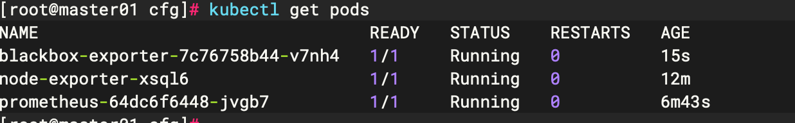

##### 创建service监控任务

```yaml
- job_name: 'kubernetes-services'
      metrics_path: /probe
      params:
        module: [http_2xx]
      kubernetes_sd_configs:
      - role: service
      relabel_configs:
      - source_labels: [__meta_kubernetes_service_annotation_prometheus_io_probe]
        action: keep
        regex: true
      - source_labels: [__address__]
        target_label: __param_target
      - target_label: __address__
        replacement: blackbox-exporter.default.svc.cluster.local:9115
      - source_labels: [__param_target]
        target_label: instance
      - action: labelmap
        regex: __meta_kubernetes_service_label_(.+)
      - source_labels: [__meta_kubernetes_namespace]
        target_label: kubernetes_namespace
      - source_labels: [__meta_kubernetes_service_name]
        target_label: kubernetes_name
```

```yaml
#在该任务配置中，通过指定kubernetes_sd_config的role为service指定服务发现模式
kubernetes_sd_configs:
  - role: service
#通过标签‘prometheus.io/probe: true’进行判断，从而过滤出需要探测的所有Service实例
- source_labels: [__meta_kubernetes_service_annotation_prometheus_io_probe]
  action: keep
  regex: true
#并且将通过服务发现获取到的Service实例地址__address__转换为获取监控数据的请求参数。同时将__address执行Blackbox Exporter实例的访问地址，并且重写了标签instance的内容
- source_labels: [__address__]
  target_label: __param_target
- target_label: __address__
  replacement: blackbox-exporter.default.svc.cluster.local:9115
- source_labels: [__param_target]
  target_label: instance
#最后，为监控样本添加了额外的标签信息
- action: labelmap
  regex: __meta_kubernetes_service_label_(.+)
- source_labels: [__meta_kubernetes_namespace]
  target_label: kubernetes_namespace
- source_labels: [__meta_kubernetes_service_name]
  target_label: kubernetes_name
```

##### 创建Ingress监控任务

```yaml
- job_name: 'kubernetes-ingresses'
      metrics_path: /probe
      params:
        module: [http_2xx]
      kubernetes_sd_configs:
      - role: ingress
      relabel_configs:
      - source_labels: [__meta_kubernetes_ingress_annotation_prometheus_io_probe]
        action: keep
        regex: true
      - source_labels: [__meta_kubernetes_ingress_scheme,__address__,__meta_kubernetes_ingress_path]
        regex: (.+);(.+);(.+)
        replacement: ${1}://${2}${3}
        target_label: __param_target
      - target_label: __address__
        replacement: blackbox-exporter.default.svc.cluster.local:9115
      - source_labels: [__param_target]
        target_label: instance
      - action: labelmap
        regex: __meta_kubernetes_ingress_label_(.+)
      - source_labels: [__meta_kubernetes_namespace]
        target_label: kubernetes_namespace
      - source_labels: [__meta_kubernetes_ingress_name]
        target_label: kubernetes_name
```


```yaml
kind: ConfigMap
apiVersion: v1
metadata:
  name: prometheus-config
  namespace: kube-system
data:
  prometheus.yml: |
    global:
      scrape_interval:     15s
      evaluation_interval: 15s
      external_labels:
        cluster: "kubernetes"
    scrape_configs:
    ############################ kubernetes-cadvisor ##############################
    - job_name: 'kubernetes-cadvisor'
      scheme: https
      metrics_path: /metrics/cadvisor
      tls_config:
        ca_file: /var/run/secrets/kubernetes.io/serviceaccount/ca.crt
      bearer_token_file: /var/run/secrets/kubernetes.io/serviceaccount/token
      kubernetes_sd_configs:
      - role: node
      relabel_configs:
      - action: labelmap
        regex: __meta_kubernetes_node_label_(.+)
      - target_label: __address__
        replacement: kubernetes.default.svc:443
      - source_labels: [__meta_kubernetes_node_name]
        target_label: __metrics_path__
        replacement: /api/v1/nodes/${1}/proxy/metrics/cadvisor
      metric_relabel_configs:
      - source_labels: [instance]
        separator: ;
        regex: (.+)
        target_label: node
        replacement: $1
        action: replace
      - source_labels: [pod_name]
        separator: ;
        regex: (.+)
        target_label: pod
        replacement: $1
        action: replace
      - source_labels: [container_name]
        separator: ;
        regex: (.+)
        target_label: container
        replacement: $1
        action: replace
    ############################ kube-state-metrics ##############################
    - job_name: "kube-state-metrics"
      kubernetes_sd_configs:
      - role: endpoints
        namespaces:
          names: ["kube-system"]
      relabel_configs:
      - action: keep
        source_labels: [__meta_kubernetes_service_label_app_kubernetes_io_name]
        regex: kube-state-metrics
      - action: labelmap
        regex: __meta_kubernetes_service_label_(.+)
      - action: replace
        source_labels: [__meta_kubernetes_namespace]
        target_label: k8s_namespace
      - action: replace
        source_labels: [__meta_kubernetes_service_name]
        target_label: k8s_sname    

```

### 使用cadvisor&kube-state-metrics监控k8s集群

#### kube-state-metrics下载地址

```shell
#下载对应k8s适配版本
https://github.com/kubernetes/kube-state-metrics/releases
```

#### kube-state-metrics部署

```yaml
tar -xvf kube-state-metrics-2.7.0.tar.gz
cd kube-state-metrics-2.7.0/examples/standard
vim deployment.yml
#修改一下镜像地址，避免拉取镜像超时
- image: kubebiz/kube-state-metrics:v2.7.0

vim service.yml
#添加service配置为可发现
annotations:
    prometheus.io/scrape: 'true'
#加载所有配置
kubectl apply -f .
#等待pod正常拉起，默认namespace为kube-system，可在配置文件中修改
kubectl get pods -n kube-system
```

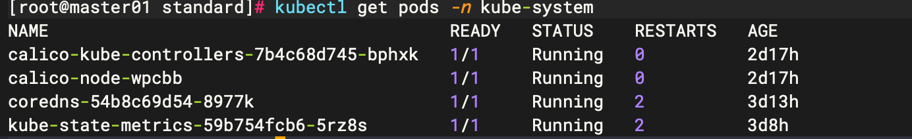

#### 添加prometheus配置文件

##### Cadvisior

kubelet自带，无需单独配置，只需添加target到prometheus配置文件

```shell
vim prometheus-configmap.yaml
```

```yaml
############################ kubernetes-cadvisor ##############################
    - job_name: 'kubernetes-cadvisor'
      scheme: https
      metrics_path: /metrics/cadvisor
      tls_config:
        ca_file: /var/run/secrets/kubernetes.io/serviceaccount/ca.crt
      bearer_token_file: /var/run/secrets/kubernetes.io/serviceaccount/token
      kubernetes_sd_configs:
      - role: node
      relabel_configs:
      - action: labelmap
        regex: __meta_kubernetes_node_label_(.+)
      - target_label: __address__
        replacement: kubernetes.default.svc:443
      - source_labels: [__meta_kubernetes_node_name]
        target_label: __metrics_path__
        replacement: /api/v1/nodes/${1}/proxy/metrics/cadvisor
      metric_relabel_configs:
      - source_labels: [instance]
        separator: ;
        regex: (.+)
        target_label: node
        replacement: $1
        action: replace
      - source_labels: [pod_name]
        separator: ;
        regex: (.+)
        target_label: pod
        replacement: $1
        action: replace
      - source_labels: [container_name]
        separator: ;
        regex: (.+)
        target_label: container
        replacement: $1
        action: replace
```

##### kube-state-metrics

```yaml
############################ kube-state-metrics ##############################
    - job_name: "kube-state-metrics"
      kubernetes_sd_configs:
      - role: endpoints
        namespaces:
          names: ["kube-system"]
      relabel_configs:
      - action: keep
        source_labels: [__meta_kubernetes_service_label_app_kubernetes_io_name]
        regex: kube-state-metrics
      - action: labelmap
        regex: __meta_kubernetes_service_label_(.+)
      - action: replace
        source_labels: [__meta_kubernetes_namespace]
        target_label: k8s_namespace
      - action: replace
        source_labels: [__meta_kubernetes_service_name]
        target_label: k8s_sname    
```

##### 完整配置文件

```yaml
kind: ConfigMap
apiVersion: v1
metadata:
  name: prometheus-config
  #namespace: kube-system
data:
  prometheus.yml: |
    global:
      scrape_interval:     15s
      evaluation_interval: 15s
      external_labels:
        cluster: "kubernetes"
    scrape_configs:
    ############################ kubernetes-cadvisor ##############################
    - job_name: 'kubernetes-cadvisor'
      scheme: https
      metrics_path: /metrics/cadvisor
      tls_config:
        ca_file: /var/run/secrets/kubernetes.io/serviceaccount/ca.crt
      bearer_token_file: /var/run/secrets/kubernetes.io/serviceaccount/token
      kubernetes_sd_configs:
      - role: node
      relabel_configs:
      - action: labelmap
        regex: __meta_kubernetes_node_label_(.+)
      - target_label: __address__
        replacement: kubernetes.default.svc:443
      - source_labels: [__meta_kubernetes_node_name]
        target_label: __metrics_path__
        replacement: /api/v1/nodes/${1}/proxy/metrics/cadvisor
      metric_relabel_configs:
      - source_labels: [instance]
        separator: ;
        regex: (.+)
        target_label: node
        replacement: $1
        action: replace
      - source_labels: [pod_name]
        separator: ;
        regex: (.+)
        target_label: pod
        replacement: $1
        action: replace
      - source_labels: [container_name]
        separator: ;
        regex: (.+)
        target_label: container
        replacement: $1
        action: replace
    ############################ kube-state-metrics ##############################
    - job_name: "kube-state-metrics"
      kubernetes_sd_configs:
      - role: endpoints
        namespaces:
          names: ["kube-system"]
      relabel_configs:
      - action: keep
        source_labels: [__meta_kubernetes_service_label_app_kubernetes_io_name]
        regex: kube-state-metrics
      - action: labelmap
        regex: __meta_kubernetes_service_label_(.+)
      - action: replace
        source_labels: [__meta_kubernetes_namespace]
        target_label: k8s_namespace
      - action: replace
        source_labels: [__meta_kubernetes_service_name]
        target_label: k8s_sname    
```

#### 配置grafana

详见grafana部署篇

```shell
#配置集群内地址
http://prometheus.default.svc.cluster.local:9090
#模版id
#import json文件
13105
```

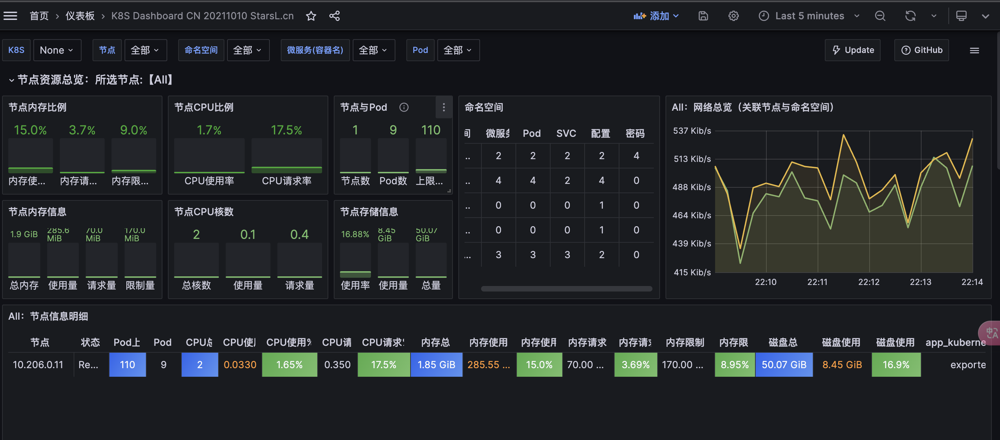

#### 部署遇到问题

<u>***由于本地集群版本为k8s v1.25.xx，此版本中kubelet已经默认不支持docker而改为支持containerd部署，若需要使用docker部署则需部署cri-docker插件。***</u>

<u>***但，部署cri-docker插件会导致cadvior无法采集到部分指标完整标签，导致监控大盘promsql无法正常展示数据。***</u>

<u>***故，建议高版本集群用户使用containerd部署kubelet，以保证部分数据标签可以完整。***</u>

## Grafana部署及监控数据

### docker部署

```shell
docker run -d -p 3000:3000 grafana/grafana
```

#### 默认访问

```shell
http://youserverip:3000
#默认账号密码
admin/admin
```

#### 添加prometheus数据源

填写prometheus服务的地址和端口号，名称自定义

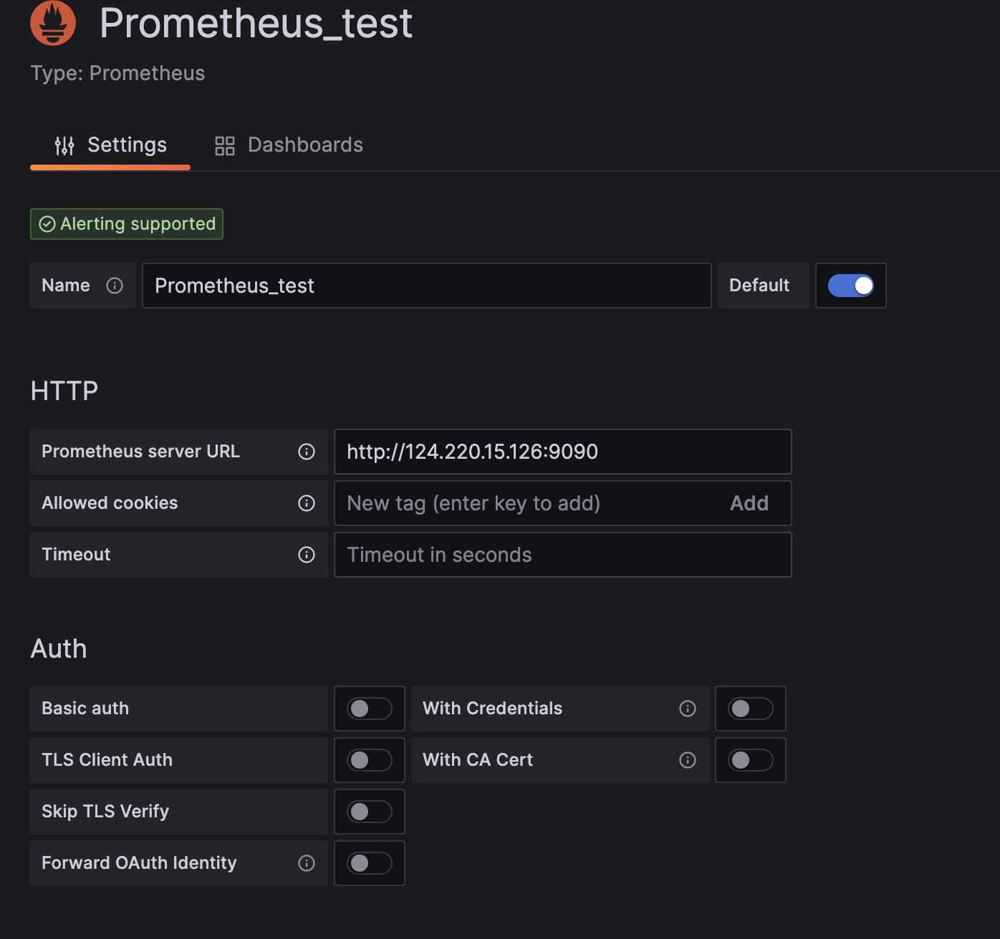

保存 save


添加仪表板（可自定义或导入第三方模版，此处省略。。。）

#### 测试地址

http://124.220.15.126:3000/d/9CWBz0bik/222aed08-968c-5a60-9c6b-50661e7529ab?orgId=1

### k8s部署grafana

#### 配置deployment

```shell
cat > /data/grafana/grafana.yaml << EOF
kind: Deployment
apiVersion: apps/v1
metadata:
  labels:
    app: grafana
  name: grafana
  namespace: default
spec:
  replicas: 1
  revisionHistoryLimit: 10
  selector:
    matchLabels:
      app: grafana
  template:
    metadata:
      labels:
        app: grafana
    spec:
      securityContext:
        runAsNonRoot: true
        runAsUser: 10555
        fsGroup: 10555
      containers:
        - name: grafana
          image: grafana/grafana:8.4.4
          imagePullPolicy: IfNotPresent
          env:
            - name: GF_AUTH_BASIC_ENABLED
              value: "true"
            - name: GF_AUTH_ANONYMOUS_ENABLED
              value: "false"
          readinessProbe:
            httpGet:
              path: /login
              port: 3000
          volumeMounts:
            - mountPath: /var/lib/grafana
              name: grafana-data-volume
          ports:
            - containerPort: 3000
              protocol: TCP
      volumes:
        - name: grafana-data-volume
          emptyDir: {}
EOF
```

#### 配置service

```shell
cat > /data/grafana/grafana-service.yaml << EOF
kind: Service
apiVersion: v1
metadata:
  labels:
    app: grafana
  name: grafana-service
  namespace: default
spec:
  ports:
    - port: 3000
      targetPort: 3000
  selector:
    app: grafana
  type: NodePort
EOF
```

#### 加载配置项目

```shell
cd /data/grafana 
kubectl apply -f grafana.yaml
kubectl apply -f grafana-service.yaml
```

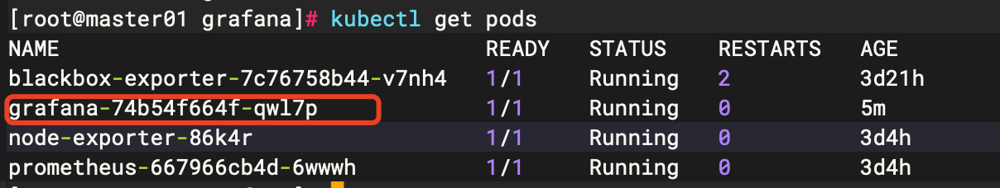

#### 配置datasource&dashboard

```shell
#配置集群内地址
http://prometheus.default.svc.cluster.local:9090
#模版id
#import json文件
13105
```

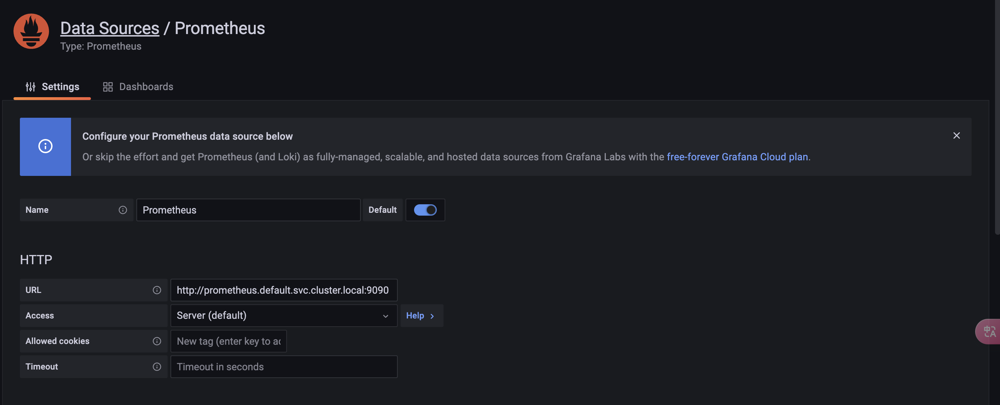

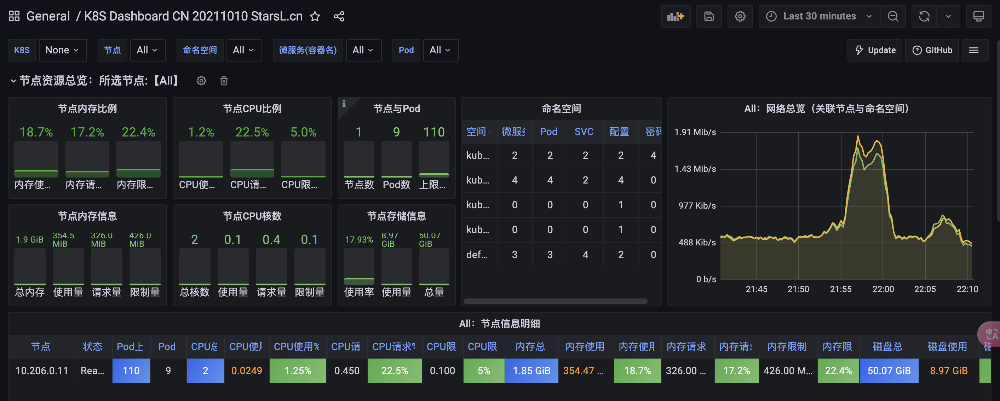

## 监控部署过程问题排查

### 问题出现

告警推送出现高cpu使用率

```markdown
Name:hostCpuUsageAlert
Labels:
alertname:hostCpuUsageAlert
instance:localhost:9100
monitor:codelab-monitor
severity:page
Annotations:
description:localhost:9100 CPU usage above 85% (current value: 1.1173950873439655)
summary:Instance localhost:9100 CPU usgae high
Status:firing
```

导致监控主机无法登陆，登陆响应缓慢

### 问题解决

登陆主机查看top

docker进程cpu过高但不至于满载情况

查看docker服务状态

```shell
docker ps卡死
docker stats卡死
docker stop container_id 卡死
systemctl restart docker 失败
```

发现containerd进程占用cpu过高

重启containerd进程

```shell
systemctl restart containerd
```

docker 恢复正常，宿主机CPU下降

### 扩展docker与containerd关系


